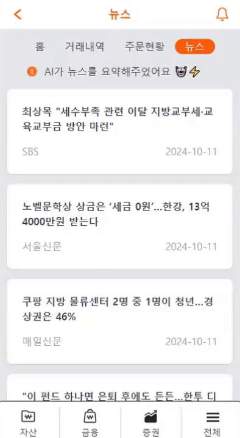
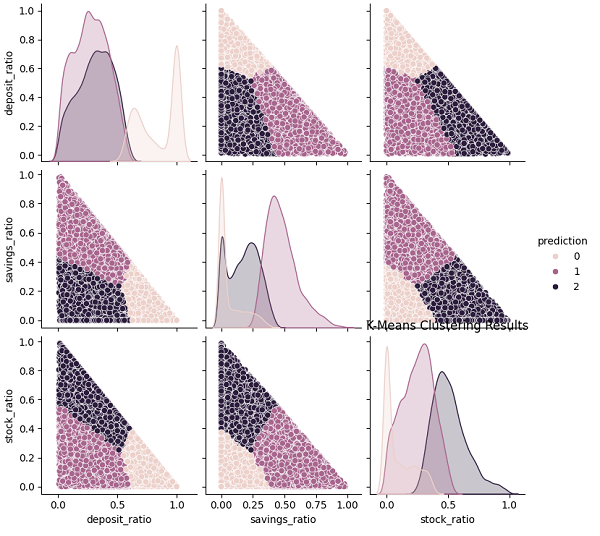
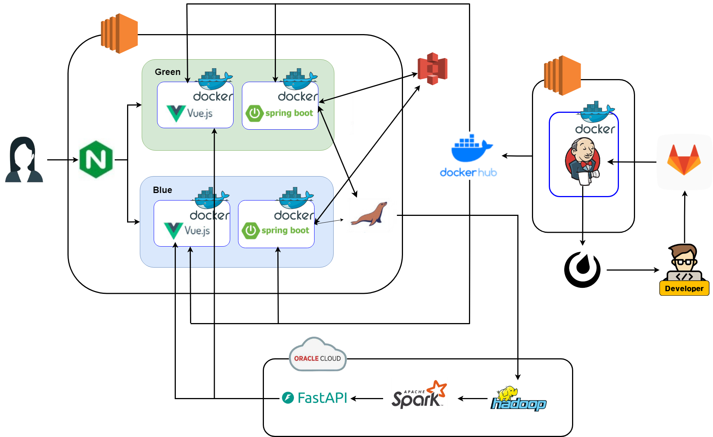

# 🧡🐥 Egg Money🧡
### 아이를 위한 금융활동 체험 서비스 


##### 프로젝트 기간 
###### 2024.08.19 ~ 2024.10.11 (약 8주)

##### 프로젝트 소개
에그머니는 고등학생 자녀를 대상으로 한 금융 교육 서비스 플랫폼입니다. <br/>
자녀는 부모가 제공한 자금을 바탕으로 투자, 대출, 출금 요청 등을 할 수 있으며, <br/>
이를 통해 사회 진출전 금융 활동의 경험을 쌓게 됩니다. <br/>

##### 주요 기능

1. 금융 API를 이용해 가상 계좌로 자금을 이체 <br/>
2. 실제 주식 시장 데이터를 기반으로 가상 주식 매입/매도 활동 구현 <br/>
3. 예금 적금 상품 조회 및 가입 기능, 대출신청 및 심사 기능 제공<br/>
4. QR 코드를 활용한 가족 연결<br/>
5. GPT를 이용한 뉴스 요약 <br/>
6. K-means 알고리즘을 활용한 금융상품 추천 서비스 <br/>
7. 재미를 위한 이벤트 요소<br/>
경제용어 퀴즈, 행운의 금융 룰렛, 돈 먹기 게임, 물가 맞추기 게임<br/>

---
#### 목차

##### 📊 I. 기술 스택

##### 💁 II. 구현 화면

##### 💻 III. 주요 기술 설명

##### ☄️ IV. 트러블 슈팅  

##### 📑 V. 프로젝트 설계

##### 🐱 VI. 팀원 소개

##### 🙇 VII. 느낀 점 및 참고사항

---
##### 📊 I. 기술 스택


|  | Front | Back | Infra |
| --- | --- | --- |  --- |
| **Language** | TypeScript | Java 17 |  |
| **Framework** | Vue3.js, Pinia | Spring Boot, JPA, QueryDSL, FastAPI |  |
| **Library** | Tailwind, PWA | JWT, JPA, QueryDSL |  |
| **DB** |  | MariaDB |  |
| **Server** |  | Node.js | Amazon EC2, Nginx, Docker, Dockerhub, Oracle Cloud, S3 |
| **CI/CD** |  |  | Jenkins |
| **ETC** | |Spark, Hadoop ||


<details>
<summary>추가 설명</summary>
<div markdown="1">
Q. 각 기술을 선택한 이유 ?
<br/><br/>
[ Front ]<br/>
Vue 3.js : 사용자 인터페이스를 구축하기 위한 진보적인 JavaScript 프레임워크.
재사용성과 유지보수성을 높이는 데 중점을 두고 있음 <br/>
Tailwind CSS :유틸리티 퍼스트 CSS 프레임워크
디자인을 빠르게 prototyping하고 사용자 정의 CSS를 줄이는 데 유용함 <br/>
PWA(Progressive Web App) : 웹 기술을 활용해 만든 애플리케이션. 웹사이트의 장점과 네이티브 애플리케이션의 장점을 결합한 형태 <br/><br/>

[ back ]<br/>
Spring Boot : Java 기반의 프레임워크. 내장 서버와 자동 구성 기능을 제공하여 개발 생산성을 높임<br/>
Spring Security : 애플리케이션의 보안을 담당하는 프레임워크로, 인증 및 권한 부여 기능을 제공<br/>
JPA (Java Persistence API) : 자바에서 데이터베이스와의 상호작용을 간편하게 해주는 ORM(Object-Relational Mapping) 기술. 데이터베이스의 엔티티를 객체 형태로 매핑할 수 있음<br/>
JWT (JSON Web Token) : 인증 정보를 안전하게 전송하기 위한 토큰 형식. 클라이언트와 서버 간의 인증 및 권한 부여를 간편하게 처리할 수 있도록 도와줌
<br/><br/>
[ DB ]<br/>
MariaDB : MySQL의 포크로, 오픈 소스 관계형 데이터베이스 관리 시스템. 뛰어난 성능과 안정성을 제공함<br/>

[ Infra ]<br/>
Node.js : 서버 측 JavaScript 실행 환경으로, 비동기 I/O 모델을 사용하여 높은 성능과 확장성을 제공함. 웹 서버나 API 서버 구축에 적합.<br/>
Amazon EC2 : 아마존 웹 서비스(AWS)의 클라우드 컴퓨팅 서비스로, 가상 서버를 손쉽게 생성하고 관리할 수 있음. 유연한 스케일링과 비용 효율성을 제공.<br/>
Nginx : 고성능 웹 서버 및 리버스 프록시 서버로, 정적 파일 제공, 로드 밸런싱, SSL/TLS 지원 등을 통해 웹 애플리케이션의 성능을 개선함.<br/>
Docker : 애플리케이션을 컨테이너화하여 배포할 수 있는 플랫폼으로, 개발 환경을 일관되게 유지하고 이식성을 높임. 여러 환경에서 동일한 성능을 보장함. <br/>
Amazon S3: 객체 저장 서비스를 제공하는 플랫폼으로, 대량의 데이터를 안전하게 저장하고 관리할 수 있는 기능을 제공함. 데이터 백업, 복구 및 정적 웹 호스팅 지원. 다양한 애플리케이션과 통합이 용이하여, 필요한 경우 언제든지 데이터를 빠르게 액세스할 수 있음.

</div>
</details>
<details>
<summary>협업 도구</summary>
<div markdown="1">
1.Git & Github<br/>
분산형 버전 관리 시스템으로<br/>
코드의 변경 사항을 추적하고 여러 개발자 간의 협업을 용이하게 함<br/><br/>


2.Jira<br/>
Atlassian에서 개발한 프로젝트 관리 및 이슈 추적 도구<br/>
주로 소프트웨어 개발 팀에서 사용되며, Agile 방법론(스크럼, 칸반 등)을 지원<br/>


<br/>
3.Mattermost <br/>
오픈 소스 팀 채팅 및 협업 플랫폼<br/>
Slack과 유사한 기능을 제공<br/>
자체 서버에 호스팅할 수 있어 보안 및 프라이버시가 중요할 때 유용<br/>


</div>
</details>
<br/>

---
##### 💁 II. 구현 화면


1️⃣ 메인페이지 & 로그인, 회원가입 

| 메인페이지| 회원가입 | 
| --- | --- | 
| |  | 

2️⃣ 가족등록 

| 가족초대 | 가족등록 | 
| --- | --- | 
|  |  | 

 3️⃣ 예적금 페이지 

| 예금가입 | 예금해지 | 
| --- | --- | 
|  |  | 

| 적금가입 | 적금납입 | 
| --- | --- | 
|  |  | 

4️⃣ 금융 상품 추천페이지 

| 추천1,2 | 추천3,4 | 
| --- | --- | 
|  |  | 

5️⃣ 대출 페이지

| 대출심사 | 대출상환 | 
| --- | --- | 
| |  | 

6️⃣ 출금 페이지  

| 출금요청 | 출금심사 | 
| --- | --- | 
| |  | 

7️⃣ 증권 페이지

| 현재가 거래 | 지정가 거래 | 
| --- | --- | 
| |  | 

| 거래내역, 주문현황 | 뉴스 | 
| --- | --- | 
| |  | 

8️⃣ 이벤트  

| 경제용어 퀴즈 | 행운의 금융 룰렛 | 
| --- | --- | 
| |  | 

| 돈 먹기 게임 | 물가 맞추기 게임 | 
| --- | --- | 
| |  | 


[▶ 에그머니 소개 영상](exec/eggmoney.mp4)

[](exec/eggmoney.mp4)

---
##### 💻 III. 주요 기술 설명

<details>
<summary> 1️⃣ 모바일 웹 : PWA (Progressive Web Apps) </summary>
<div markdown="1">

### PWA (Progressive Web Apps)란?

웹 기술을 활용해 네이티브 앱처럼 작동하는 웹 애플리케이션입니다. PWA 기술을 활용하면 PC에서 뿐 아니라 모바일에서도 서비스에 접근할 수 있게 됩니다. 최근에는 PC보다 모바일을 사용하는 경우가 늘어나고 있는데, 이러한 시대의 변화에 맞춰 자녀가 더욱 편리하게 에그머니 서비스를 이용할 수 있도록 하기 위해 PWA 기술을 도입하였습니다.


#### 주요 특징 

1. **오프라인 작동: 언제 어디서나 금융 교육**  
   서비스 워커를 통해 네트워크 연결 없이도 앱을 사용할 수 있어, 자녀가 학교나 외출 중에도 금융 활동을 연습할 수 있습니다. 이를 통해 금융 지식과 경험을 자연스럽게 습득할 수 있습니다.
  
2. **빠른 로딩 속도: 즉각적인 정보 접근**  
   캐싱 기술 덕분에 페이지가 신속하게 로드되어, 자녀가 원하는 금융 정보를 즉시 확인할 수 있습니다. 이로 인해 학습의 흐름이 끊기지 않고, 자녀가 적극적으로 참여하게 됩니다.

3. **푸시 알림: 금융 교육의 지속적인 동기 부여**  
   사용자가 앱을 떠나더라도 알림을 통해 금융 교육과 관련된 중요한 정보를 상기시킬 수 있습니다. 부모와 자녀 간의 소통을 강화하며, 자녀가 금융 교육에 지속적으로 관심을 가질 수 있도록 돕습니다.

4. **반응형 디자인: 다양한 기기에서의 편리한 접근**  
   모든 기기에서 최적화된 경험을 제공하여, 자녀가 스마트폰이나 태블릿으로 언제든지 금융 교육에 접근할 수 있습니다. 이렇게 높아진 접근성은 자녀의 금융 이해도를 높이는 데 기여합니다.

5. **설치 가능: 네이티브 앱처럼 편리하게 사용**  
   PWA를 홈 화면에 추가하여 마치 네이티브 앱처럼 사용할 수 있어, 자녀가 금융 교육 플랫폼에 자주 접근하게 만듭니다. 이는 학습의 연속성을 높이고, 금융 개념을 쉽게 접할 수 있게 합니다.

#### 장점 및 효과

- **크로스 플랫폼 지원: 모든 기기에서의 일관된 경험**  
  iOS, Android, 데스크탑 등 다양한 플랫폼에서 동일한 사용자 경험을 제공하므로, 자녀가 자신의 기기에서 언제든지 금융 활동을 경험할 수 있습니다. 이는 자녀의 금융 교육에 유연성을 부여합니다.

- **유지보수 용이: 지속적인 서비스 개선**  
  하나의 코드베이스로 여러 플랫폼을 지원하므로, 개발자들이 시간과 자원을 효율적으로 사용할 수 있습니다. 이는 서비스의 지속적인 업데이트와 기능 개선을 가능하게 하여, 항상 최신의 금융 교육 콘텐츠를 제공합니다.

- **비용 절감: 추가 기능 개발의 여유**  
  네이티브 앱 개발에 비해 개발 및 배포 비용이 낮아, 추가 기능이나 콘텐츠 개발에 더 많은 자원을 투자할 수 있습니다. 이를 통해 자녀의 금융 교육을 더욱 풍부하게 만들 수 있습니다.

- **사용자 경험 향상: 실생활 금융 지식 적용**  
  빠른 로딩과 오프라인 사용 가능성 덕분에 자녀는 언제 어디서나 금융 교육을 지속할 수 있으며, 이는 실제 생활에서 금융 지식을 적용하는 데 긍정적인 영향을 미칩니다.

- **강화된 참여 유도: 금융 교육에 대한 지속적 관심**  
  푸시 알림을 통해 금융 교육의 중요성을 지속적으로 상기시킬 수 있어, 자녀의 학습 동기를 높이고 금융 교육에 대한 흥미를 유지하는 데 기여합니다.

</div>
</details>


<details>
<summary> 2️⃣ CI/CD 구축 : Blue/Green 배포</summary>
<br/>


Blue/Green 배포는 애플리케이션의 새로운 버전을 배포할 때 서비스 중단을 최소화하는 전략입니다. 두 개의 환경(Blue와 Green)을 사용하여 안전하고 원활한 배포를 진행합니다. 

### 이 기술을 선택한 이유

1. **사용자 경험 유지**<br/> 금융 교육과 관련된 서비스는 안정성과 신뢰성이 필수적입니다. Blue/Green 배포를 통해 업데이트 중에도 사용자에게 중단 없는 서비스를 제공할 수 있습니다. 이는 사용자 불만을 최소화하고, 금융 교육의 연속성을 보장합니다.

2. **신속한 롤백 가능성**<br/>금융 서비스는 예기치 않은 오류나 문제가 발생할 경우 즉시 대응해야 합니다. Blue/Green 배포를 통해 새로운 버전에서 문제가 발생하더라도, 빠르게 이전 안정적인 버전으로 롤백할 수 있습니다. 이는 서비스의 안정성을 높이고, 사용자의 신뢰를 유지하는 데 큰 도움이 됩니다.

3. **안전한 배포 테스트**<br/> 새로운 기능이나 업데이트를 배포하기 전에 Green 환경에서 충분히 테스트할 수 있습니다. 이를 통해 성능이나 사용성에 문제가 없는지 확인할 수 있으며, 문제가 발견될 경우 배포를 지연할 수 있습니다.

4. **비교 분석 가능**<br/> 두 환경에서의 성능을 비교하여 최적의 결과를 도출할 수 있습니다. 이를 통해 지속적으로 서비스 품질을 개선하고, 자녀의 금융 교육에 최적화된 기능을 제공할 수 있습니다.

5. **유연한 배포 전략**<br/> 금융 교육 플랫폼은 다양한 기능 업데이트가 필요합니다. Blue/Green 배포는 이러한 변화에 유연하게 대응할 수 있는 배포 전략을 제공하여, 서비스 개선과 사용자의 요구에 신속히 대응할 수 있습니다.

### 주요 특징

- **두 개의 환경**: 하나는 현재 운영 중인 환경(Blue), 다른 하나는 새로운 버전이 배포되는 환경(Green)입니다.

- **신속한 전환**: 새로운 버전이 준비되면 트래픽을 Blue에서 Green으로 전환하여 신속하게 서비스 전환이 가능합니다.

- **롤백 용이**: 새로운 버전이 문제가 발생할 경우, 빠르게 이전 버전으로 롤백할 수 있습니다.

### 장점

- **서비스 중단 최소화**: 사용자에게 거의 영향을 미치지 않고 업데이트를 적용할 수 있습니다.

- **비교 테스트 가능**: 두 환경에서 성능을 비교하여 문제를 조기에 발견할 수 있습니다.

- **신뢰성**: 새로운 기능을 안정적으로 배포할 수 있어 신뢰성을 높일 수 있습니다.

</details>


<details>
<summary>3️⃣ 금융상품 추천 알고리즘: 하둡, 스파크, FastAPI</summary>

### 1. 추천 로직 개요

- **정의**: 
  - K-means 알고리즘을 이용하여 3개의 인자(**주식**, **적금**, **예금**)을 사용해서 세 가지 금융 항목에 대한 사용자들의 데이터를 분석합니다. **클러스터링(군집화)**과정이 끝난 후, 군집별 최다 상품을 검색하고 학습이 완료된 모델을 통해 군집별 추천 상품을 제공합니다.
  - 예를 들어, 사용자의 **예금**이 많으면 **예금 클러스터**, **적금**이 많으면 **적금 클러스터**로 분류됩니다.
  - 상품 추천을 요청한 사용자는 클러스터를 분류받고, 해당 클러스터에 해당하는 금융 상품을 제공받게 됩니다.

### 2. 하둡 및 Spark를 활용한 데이터 처리

1. **하둡(Hadoop)**:
   - 매일 **0시**, **MariaDB**의 데이터를 기반으로 하둡에 데이터를 저장하여 학습 모델(**K-means** 알고리즘 모델)을 갱신합니다.
   - 이 과정에서 사용자의 **예금**, **적금**, **주식** 데이터를 추출하여 클러스터링을 위한 입력값으로 사용합니다.

2. **Spark**:
   - Spark는 대규모 데이터를 처리하는 데 특화된 프레임워크로, 데이터를 분산 처리하여 분석합니다.
   - Spark가 사용자에게 맞는 **클러스터 ID(군집 분류)**와 **추천 상품 ID**를 생성하여 **FastAPI**를 통해 반환합니다.

    

    **그래프에 포함된 변수들:**
    - **deposit_ratio**: 사용자의 총 자산 중 예금이 차지하는 비율.
    - **savings_ratio**: 사용자의 총 자산 중 적금이 차지하는 비율.
    - **stock_ratio**: 사용자의 총 자산 중 주식이 차지하는 비율.
    - **prediction**: K-Means 클러스터링 결과로 나온 클러스터 ID.

    **각 그래프의 해석:**
    pairplot에서 만들어지는 9개의 그래프는 아래와 같은 의미를 가집니다.
    1. **deposit_ratio vs deposit_ratio**: 대각선에 위치한 히스토그램: 예금 비율의 분포를 나타냅니다. 클러스터 별로 색상이 구분되며, 각 클러스터의 사용자들이 예금 비율에서 어떻게 분포되어 있는지를 확인할 수 있습니다.
    2. **deposit_ratio vs savings_ratio**: 산점도: 예금 비율과 적금 비율 간의 상관 관계를 나타냅니다. 각 점은 개별 사용자를 나타내며, 색상은 클러스터를 나타냅니다. 특정 클러스터에 속하는 사용자들이 예금과 적금 비율 간에 어떤 패턴을 보이는지 확인할 수 있습니다.
    3. **deposit_ratio vs stock_ratio**: 산점도: 예금 비율과 주식 비율 간의 관계를 나타냅니다. 각 클러스터의 사용자가 예금과 주식에 어떻게 자산을 배분하는지 파악할 수 있습니다.
    4. **savings_ratio vs deposit_ratio**: 2번 그래프와 동일: 대칭적인 pairplot이므로, 해석은 2번과 동일합니다.
    5. **savings_ratio vs savings_ratio**: 대각선에 위치한 히스토그램: 적금 비율의 분포를 보여줍니다. 각 클러스터의 사용자들이 적금 비율에서 어떻게 분포되는지 확인할 수 있습니다.
    6. **savings_ratio vs stock_ratio**: 산점도: 적금 비율과 주식 비율 간의 상관 관계를 나타냅니다. 적금 비율이 높을수록 주식 비율이 낮은 패턴이나, 특정 클러스터의 사용자들이 두 비율 간에 어떤 특징을 보이는지 확인할 수 있습니다.
    7. **stock_ratio vs deposit_ratio**: 3번 그래프와 동일: 대칭적인 pairplot이므로, 해석은 3번과 동일합니다.
    8. **stock_ratio vs savings_ratio**: 6번 그래프와 동일: 대칭적인 pairplot이므로, 해석은 6번과 동일합니다.
    9. **stock_ratio vs stock_ratio**: 대각선에 위치한 히스토그램: 주식 비율의 분포를 나타냅니다. 클러스터 별로 주식 비율의 분포가 어떻게 나뉘어 있는지 확인할 수 있습니다.

3. 클러스터별 해석:
   클러스터링 결과(prediction)에 따라 각 점이 다른 색상으로 구분되어 있으므로, 각 클러스터에 속하는 사용자들의 자산 분포 특성을 파악할 수 있습니다. 예를 들어:

    - **클러스터 0**: 예금 비율이 높고, 적금과 주식 비율이 낮은 사용자들로 구성될 수 있습니다.
    - **클러스터 1**: 적금 비율이 높은 사용자가 많고, 예금과 주식의 비율이 상대적으로 낮은 특성을 보일 수 있습니다.
    - **클러스터 2**: 주식 비율이 다른 자산에 비해 높은 사용자들로 구성될 수 있습니다.

4. **종합적인 해석**:
   이 그래프들은 자산 비율 간의 상관 관계와 클러스터링 결과를 시각적으로 확인할 수 있게 해 줍니다. 사용자의 자산 분포가 어떻게 다른지, 특정 클러스터에서 자산의 비율이 어떻게 나타나는지 확인할 수 있으며, 이를 통해 각 클러스터의 사용자 특성을 파악할 수 있습니다.

### 3. 사용자 유형 분류

- 프론트 페이지에서는 사용자의 금융 데이터 비율에 따라 사용자 유형을 분류합니다.
  - **예금**이 많으면: **안전 제일**.
  - **적금**이 많으면: **꾸준한 저축가**.
  - **주식**이 많으면: **미래의 투자자**.
  - **아무 금융 항목도 없으면**: **초보자**로 분류됩니다.
  
- 이 분류 기준을 바탕으로 맞춤형 금융 상품을 추천하며, 사용자와 유사한 성향의 사용자들이 가장 많이 가진 상품을 제안할 수 있습니다.

### 4. 대출 데이터 처리

- 그동안 **Loan 테이블**에서 승인된 대출 데이터를 기반으로 대출 타입별로 **Group by**하여 대출 이율 평균값을 제시합니다.
- 부모님이 대출 이율 선정에 어려움이 있을 경우, 도움을 주는 지표 역할을 합니다.
- 이 과정에서 생성된 데이터는 자동으로 **하둡(Hadoop)**에 저장되어 계산됩니다.

### 5. 기타 기술적 세부 사항

- **데이터 갱신 주기**: 학습 모델은 매일 0시에 MariaDB에서 추출된 최신 데이터를 기반으로 갱신됩니다. 이를 통해 최신 정보를 반영하여 추천의 정확도를 높입니다.

</details>


<details>
<summary> 4️⃣ 금융 API 활용 : 1원인증 구현</summary>

### 1원인증이란?
사용자가 1원의 금액을 인증을 통해 확인하고, 해당 금액을 통해 사용자 신원을 증명하는 방식입니다. 실제 토스와 같은 금융 기관에서도 자주 활용하고 있는 방법 중 하나입니다. 

  

### 이 기술을 선택한 이유

에그머니 서비스는 자녀의 금융 교육을 목표로 하고 있으며, 이를 위해서는 사용자 신원 확인과 보안이 매우 중요합니다. 이를 위해, 실제 많은 금융권에서 채택하고 있는 1원 인증 방식이 안전하고 신뢰할 수 있는 금융 교육 경험을 제공하는 데 필수적인 기술이라 생각하여 채택하게 되었습니다.

1. **보안성 강화** <br/>
1원 인증을 통해 신원을 확인함으로써, 불법적인 접근을 방지하고 사용자의 안전을 보장할 수 있습니다.

2. **사용자 경험 최적화** <br/>
간편한 인증 절차는 자녀와 부모가 쉽게 접근할 수 있도록 도와줍니다. 복잡한 인증 과정을 줄이고, 금융 교육에 더 집중할 수 있는 환경을 제공합니다.

3. **신뢰 구축** <br/> 부모와 자녀 모두에게 신뢰를 줄 수 있는 시스템입니다. 자녀가 금융 활동을 경험하기 전에 안전하게 인증받을 수 있어, 서비스에 대한 신뢰감을 높입니다.

4. **유연한 통합 가능성** <br/> 다양한 금융 API와의 통합이 용이하므로, 미래에 추가할 수 있는 기능이나 서비스 확장을 위한 기반을 마련할 수 있습니다. 이는 지속적인 서비스 개선에 기여합니다.

5. **적은 비용으로 효과적인 인증** <br/> 소액 결제 방식으로 인해 비용 부담이 적으며, 신원을 증명하는 효과적인 방법을 제공할 수 있습니다. 이는 자원 효율적인 운영에 기여합니다.

### 구현 방식

1. **사용자 요청**: 사용자가 인증 요청을 하여 1원 결제를 시도합니다.

2. **결제 시스템 연동**: 결제 시스템과 연동하여 1원 결제를 진행합니다.

3. **인증 완료**: 결제가 완료되면 인증이 완료된 것으로 간주하고, 사용자는 서비스를 이용할 수 있습니다.

### 장점

- **높은 신뢰성**: 소액 결제를 통해 사용자 신원을 확인함으로써 보안성을 강화합니다.

- **간편한 사용자 경험**: 간단한 인증 절차로 사용자 경험을 개선할 수 있습니다.

- **API 통합**: 공통 API를 통해 다양한 서비스와의 통합이 용이합니다.

</details>

---
##### ☄️ IV. 트러블 슈팅  

<details>
<summary> 1️⃣ Git Revert Trouble Shooting </summary>
<div markdown="1">

#### 문제상황


Merge를 취소하려고, Revert를 여러번 반복해서 back쪽 코드들이 이전으로 돌아가게 되었습니다.

#### 해결방안 

back 폴더를 지운 후, 이전 로그 번호로 되돌리는 방식으로 해결했습니다.
Front 수정 코드는 로컬에 있기 때문에, 이것만 해결하면 되었습니다.

#### 참고
`git reset` 명령어로 특정 커밋(`cfc2fb2b`)로 되돌릴 수 있습니다.
**`-hard` 옵션**: 해당 커밋으로 작업 디렉토리, 인덱스, HEAD를 모두 되돌립니다. 다만, 현재 작업 중인 파일의 변경 사항도 모두 사라지니 주의해야 합니다.

```bash

git reset --hard cfc2fb2b

```

</div>
</details>

<details>
<summary> 2️⃣ 젠킨스 authorized_keys 설정 에러</summary>
<br/>

#### 문제상황


```bash

ssh -o StrictHostKeyChecking=no deployuser@j11c204.p.ssafy.io "bash /home/deployuser/deploy_back.sh"
Shell Script
5.3 sec
+ ssh -o StrictHostKeyChecking=no deployuser@j11c204.p.ssafy.io bash /home/deployuser/deploy_back.sh
Warning: Permanently added 'j11c204.p.ssafy.io' (ED25519) to the list of known hosts.
deployuser@j11c204.p.ssafy.io: Permission denied (publickey).
script returned exit code 255

```
#### 해결방안 
Jenkins 서버에서 deployuser를 사용하여 운영 서버에 SSH로 접근하기 <br/>
1.deployuser 사용자 추가
```bash
sudo adduser deployuser
```


2.deployuser 사용자에 대한 .ssh/authorized_keys 파일 설정<br/>
(1) deployuser 사용자로 전환
```bash
sudo su - deployuser
```
(2) .ssh 디렉토리를 생성하고 권한을 설정
```bash
mkdir -p ~/.ssh 
chmod 700 ~/.ssh
```
(3) authorized_keys 파일을 생성
```bash
touch ~/.ssh/authorized_keys 
chmod 600 ~/.ssh/authorized_keys
```
3.Jenkins 서버에서 공개키 생성<br/>
(1) SSH 키 생성<br/>
/root/.ssh 디렉토리에 SSH 키가 없으면 새로 생성해야 함
```bash
 ssh-keygen -t rsa -b 4096 -C "your_email@example.com"
```
(2) Jenkins 서버의 SSH 공개 키를 authorized_keys에 추가
```bash
 cat ~/.ssh/id_rsa.pub
```
4.SSH를 통해 deployuser 계정으로 접근 후 테스트
```bash
ssh deployuser@{운영서버 IP} 
```
5.서버의 SSH 설정 확인<br/>
(1) /etc/ssh/sshd_config <br/>
운영 서버에 접속한 후, SSH 설정 파일 열기
```bash
sudo nano /etc/ssh/sshd_config
```
(2) SSH 서버가 공개 키 인증을 허용하고 있는지 확인<br/>
없으면, 맨 아래줄에 추가
```bash
PubkeyAuthentication yes
```
(3) 설정 변경 후 SSH 서비스를 재시작<br/>
이 단계들을 수행하면 Jenkins 서버에서 deployuser를 사용하여 운영 서버에 SSH로 접근할 수 있게 된다
```bash
sudo systemctl restart ssh
```
#### 젠킨스


#### Front 배포 성공


#### Maria DB 데이터


#### 백엔드 배포 성공


</details>


---
##### 📑 V. 프로젝트 설계

<details>
<summary> 🗂️ 요구사항 명세 </summary>
<div markdown="1">
<br/>
	

</div>
</details>
<details>
<summary> 🗂️ 기능 명세  </summary>
<div markdown="1">
	


</div>
</details>

<details>
<summary> 🗂️ API 명세  </summary>
<div markdown="1">
	


</div>
</details>

<details>
<summary>🎨 Figma  </summary>
<div markdown="1">

[📎 Figma Link  ](https://www.figma.com/design/E4YJ6rv2618zTQV5R0jBPp/C204%ED%8C%80?t=e62ogsR1DgnWEkqL-0).


#### 부모님 


#### 자녀


</div>
</details>

<details>
<summary>&#128195; ERD  </summary>
<div markdown="1">
<br/>


</div>
</details>

<details>
<summary> &#128217; Architecture  </summary>
<div markdown="1">
<br/>



<br/>
</div>
</details>


---
##### 🐱 VI. 팀원 소개
Full Stack 5명 + Front 1명


| 이름 | 역할 |   
| --- | --- |
| 나경준 | [팀장] <br/> 카카오 소셜 로그인 기능 <br/>회원 관리 로직 제작 <br/> QR코드를 활용한 가족 연결 기능<br/>간편 비밀번호 제작 <br/> 입금계좌 등록 및 1원 인증 기능 구현<br/> S3를 활용한 데이터 관리 <br/> 알림 기능 프런트 페이지 (예적금 가입, 대출 심사, 출금 요청 등) <br/>전문가 리뷰 사전질문 및 멘토-멘티 활동일지 작성 <br/>  PPT 제작 및 프로젝트 발표 <br/> 베스트 멤버 선정 | 
| 곽재은 | [프런트] <br/>주식 분석 및 종목 확인 기능 Front (차트 포함) <br/> 주식 매수 및 매도 기능 Front (거래내역 및 주문현황) <br/> Vue.js 공통 컴포넌트 제작, PWA 설정 <br/> 팀 내 컨벤션 관리 및 Code Formatting 담당 <br/> UCC 서포트| 
| 김신범 | 주식 분석 및 종목 확인 기능 Back & DB (차트 포함)  <br/> 주식 매수 및 매도 기능 Back & DB (거래내역 및 주문현황)<br/>주식 테이블 설계 최적화<br/>지정가 거래 예약 기능<br/>주식 가격 업데이트(CRON 활용, 매일 4시 50분에 자동 진행)  <br/>알림 기능 (저장, 리스트 불러오기, 읽음여부 확인)<br/>  Chat GPT를 활용한 뉴스 요약 (매일 4시55분에 데이터 load 스케줄링 기능 포함) <br/> Jira 관리 및 작성 독려| 
| 정지영 &nbsp; | 입금 계좌 관리 기능  <br/>출금 신청 및 심사 기능<br/>예금, 적금 가입 및 해지  <br/> 예적금 상품 CRUD  <br/>  대출 신청 및 심사 기능<br/>원리금균등상환, 만기일시상환 기능 구현 <br/> 자산 분석 및 자산추이 그래프 구현 <br/>UCC 제작, ERD 회의 기록 |
| 황우성 | 입금 계좌 관리 기능  <br/>출금 신청 및 심사 기능<br/>예금, 적금 가입 및 해지 <br/>예적금 상품 CRUD  <br/> SSAFY 공동망 API 기반 계좌 이체 기능 구현<br/>대출 신청 및 심사 기능<br/> 자산 분석 및 자산추이 그래프 구현 <br/>HADOOP, Spark 기반 개인 맞춤 상품 추천 알고리즘 구현 (빅데이터 분산 처리) <br/>-> K-means 알고리즘 활용 군집화 (초보자, 안전 제일, 꾸준한 저축가, 미래의 투자가)<br/> Oracle Cloud 서버 기반 FASTAPI를 활용한 빅데이터 활용 서비스 제공<br/>경제 용어 퀴즈 백로직 구현<br/>인프라 서포트 |  
| 정소영 | 인프라 CI/CD 구축<br/> 회원 & 전체 페이지 프런트 <br/> 이벤트 담당 (경제 용어 퀴즈, 행운의 금융 룰렛, 돈 먹기 게임, 물가 맞추기 게임)<br/>DailyScrum 및 팀 회의 기록 정리 <br/> Porting Manual 및 README 작성 |  

---
##### 🙇 VII. 느낀 점


| 이름 | 느낀점 |   
| --- | --- |
| 나경준 &nbsp;&nbsp;&nbsp;&nbsp;&nbsp;&nbsp;&nbsp;&nbsp;&nbsp;&nbsp; | 이번 프로젝트에서 팀장을 맡으면서 많은 도전과 배움을 얻을 수 있었습니다. 특히 소셜 로그인 기능을 구현하는 과정에서 OAuth 인증 방식에 대해 깊이 이해하게 되었고, 다양한 회원 관련 기능을 팀원들과 함께 개발하며 협업의 중요성을 실감했습니다. 팀원들과 적극적으로 소통하고 의견을 조율하는 과정에서 리더십과 책임감을 키울 수 있었던 것이 큰 성장의 계기가 되었습니다. 마지막 발표 준비 과정에서도 각자의 역할을 최대한 반영하려고 노력했고, 그 덕분에 팀 전체가 단단하게 하나로 뭉쳤다는 느낌을 받았습니다. | 
| 곽재은 | PWA(프로그레시브 웹 앱) 셋업과 주식 기능 구현을 맡으면서 프론트엔드와 서버 사이의 데이터 흐름을 원활하게 처리하는 것이 매우 중요하다는 것을 깨달았습니다. 특히 공통 컴포넌트 개발을 통해 유지보수의 편리함과 재사용성의 가치를 실감할 수 있었습니다. 알림 기능을 구현하면서 사용자 경험(UX)에도 신경을 많이 쓰게 되었고, 작은 부분이라도 사용자의 입장에서 생각하는 습관을 기를 수 있었습니다. 이번 프로젝트는 개발 실력을 한층 더 성장시킬 수 있는 좋은 기회였고, 팀원들과의 협업도 매우 즐거웠습니다. | 
| 김신범 | 주식 기능을 담당하며 주식 데이터 API와의 연동 부분이 생각보다 까다로웠습니다. 이를 해결하면서 API를 어떻게 효율적으로 관리하고 성능을 최적화할 수 있을지 고민하는 시간이 많았던 것 같습니다. 또한, Spring Boot의 기본 셋업을 진행하면서 서버 환경 구성을 처음부터 끝까지 경험해볼 수 있었고, 백엔드의 중요한 역할을 다시 한번 깨닫게 되었습니다. 이 프로젝트를 통해 기술적인 부분 외에도 팀과의 협력, 의견 조율에서 많은 배움을 얻었습니다. 앞으로도 이런 경험을 바탕으로 더 나은 개발자가 되고 싶습니다. | 
| 정지영 | 자산 및 금융 관련 기능을 개발하면서 데이터베이스 구조와 효율적인 쿼리 작성의 중요성을 느꼈습니다. 또한, Spring Boot와 DB의 기본 셋팅을 맡으면서 서버와 데이터베이스가 유기적으로 연결되어야 한다는 점을 다시 한번 깨달았고, 데이터 일관성을 유지하기 위한 방법들을 고민하게 되었습니다. UCC 제작도 진행하며 개발 외적인 부분에서도 창의성을 발휘할 수 있었던 점이 재미있었습니다. 팀원들과의 협업 과정에서 얻은 소중한 경험들이 앞으로도 큰 자산이 될 것 같습니다. | 
| 황우성 | 금융 서비스와 로직을 개발하면서 느낀 것은 기능 개발에 대한 어려움보다는 세세한 예외 처리와 트랜잭션 처리가 상당히 어렵다는 것이었습니다. 때문에 예외처리 및 테스트에 많은 시간을 들였습니다. 아쉬운 점은 프론트 페이지 구현 작업량이 많아 TDD(테스트 기반 개발)을 못해본 것이 아쉽습니다. 잘된 점은 이번 프로젝트를 통해서 사용해보지 못했던 HADOOP, SPARK를 이용한 빅데이터 분산 처리를 활용한 서비스 구현을 경험해 볼 수 있어 좋았습니다. 저는 이번 프로젝트를 통해 공동망 API를 활용하여 실제 계좌를 관리하는 은행 서비스를 일부나마 체험하고 구현할 수 있어 좋았고, 뛰어난 팀원들과 함께 매일 좋은 분위기에서 함께 할 수 있어 좋았습니다. | 
| 정소영 | 이전에는 Dothome이나 CloudType 같은 호스팅 서비스를 사용해서 웹 배포를 진행했습니다. 그런데 이번 기회를 통해서 처음부터 배포 파이프라인을 구성해볼 수 있어서 좋았습니다. Docker 컨테이너를 통해 애플리케이션의 이식성을 높이고, 일관된 개발 및 배포 환경을 제공할 수 있었습니다. 또한, Jenkins를 활용해 빌드, 테스트, 배포 과정을 효율화할 수 있었던 것 같습니다. 추가로 Blue/Green 방법을 사용해 배포 환경을 자동화한 것이 개발의 효율성을 높여주고 빌드 시 발생할 수 있는 실수를 줄이는 좋은 방법이 된다는 것을 깨닫게 되었습니다.<br/> 팀원들과 함께하는 시간들이 즐거웠고, 개발자로서 논리적으로 생각하고 판단하는 법을 배울 수 있었습니다. 팀 내에 서로 배려하는 문화가 있어서 좋았습니다. 뛰어난 팀원들과 함께할 수 있는 있어서 감사합니다. |
