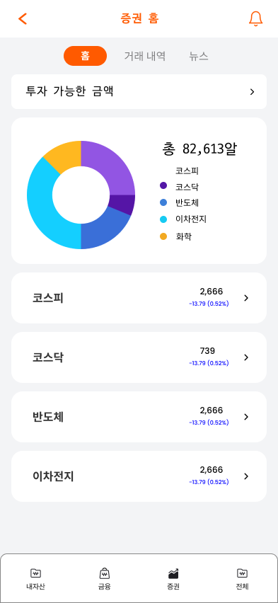
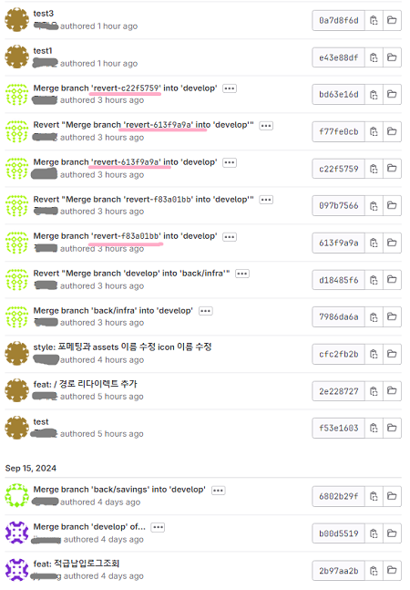
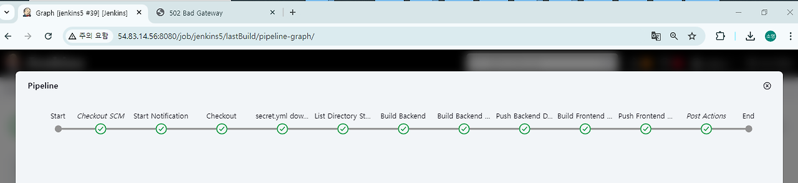

# 🧡🐥 Egg Money🧡
### 아이를 위한 금융활동 체험 서비스 

##### 프로젝트 기간 
###### 2024.08.19 ~ 2024.10.11 (약 8주)

##### 프로젝트 소개
에그머니는 고등학생 자녀를 대상으로 한 금융 교육 서비스 플랫폼입니다. <br/>
자녀는 부모가 제공한 자금을 바탕으로 투자, 대출, 출금 요청 등을 할 수 있으며, <br/>
이를 통해 사회 진출전 금융 활동의 경험을 쌓게 됩니다. <br/>

##### 주요 기능

1. 금융 API를 이용해 가상 계좌로 자금을 이체 <br/>
2. 실제 주식 시장 데이터를 기반으로 가상 주식 매입/매도 활동 구현 <br/>
3. 금융 뉴스: GPT를 이용한 뉴스 요약 제공 <br/>

---
#### 목차

##### 📊 I. 기술 스택

##### 💁 II. 구현 화면

##### 💻 III. 주요 기술 설명

##### ☄️ IV. 트러블 슈팅  

##### 📑 V. 프로젝트 설계

##### 🐱 VI. 팀원 소개

##### 🙇 VII. 느낀 점 및 참고사항

---
##### 📊 I. 기술 스택

|  | Front | Back | Infra |
| --- | --- | --- |  --- |
| **Language** | TypeScript | Java 17 |  |
| **Framework** | Vue3.js | Spring Boot, Spring Security |  |
| **Library** | Tailwind, PWA | JWT, JPA |  |
| **DB** |  | MariaDB |  |
| **Server** |  | Node.js | Amazon EC2, Nginx, Docker |
| **CI/CD** |  |  | Jenkins, Mattermost |

<br/>

<details>
<summary>추가 설명</summary>
<div markdown="1">
<br/>
각 기술을 선택한 이유
<br/><br/>
[ Front ]<br/>
Vue 3.js : 사용자 인터페이스를 구축하기 위한 진보적인 JavaScript 프레임워크.
재사용성과 유지보수성을 높이는 데 중점을 두고 있음 <br/>
Tailwind CSS :유틸리티 퍼스트 CSS 프레임워크
디자인을 빠르게 prototyping하고 사용자 정의 CSS를 줄이는 데 유용함 <br/>
PWA(Progressive Web App) : 웹 기술을 활용해 만든 애플리케이션. 웹사이트의 장점과 네이티브 애플리케이션의 장점을 결합한 형태 <br/><br/>

[ back ]<br/>
Spring Boot : Java 기반의 프레임워크. 내장 서버와 자동 구성 기능을 제공하여 개발 생산성을 높임<br/>
Spring Security : 애플리케이션의 보안을 담당하는 프레임워크로, 인증 및 권한 부여 기능을 제공<br/>
JPA (Java Persistence API) : 자바에서 데이터베이스와의 상호작용을 간편하게 해주는 ORM(Object-Relational Mapping) 기술. 데이터베이스의 엔티티를 객체 형태로 매핑할 수 있음<br/>
JWT (JSON Web Token) : 인증 정보를 안전하게 전송하기 위한 토큰 형식. 클라이언트와 서버 간의 인증 및 권한 부여를 간편하게 처리할 수 있도록 도와줌
<br/><br/>
[ DB ]<br/>
MariaDB : MySQL의 포크로, 오픈 소스 관계형 데이터베이스 관리 시스템. 뛰어난 성능과 안정성을 제공함<br/>

[ Infra ]<br/>
Node.js : 서버 측 JavaScript 실행 환경으로, 비동기 I/O 모델을 사용하여 높은 성능과 확장성을 제공함. 웹 서버나 API 서버 구축에 적합.<br/>
Amazon EC2 : 아마존 웹 서비스(AWS)의 클라우드 컴퓨팅 서비스로, 가상 서버를 손쉽게 생성하고 관리할 수 있음. 유연한 스케일링과 비용 효율성을 제공.<br/>
Nginx : 고성능 웹 서버 및 리버스 프록시 서버로, 정적 파일 제공, 로드 밸런싱, SSL/TLS 지원 등을 통해 웹 애플리케이션의 성능을 개선함.<br/>
Docker : 애플리케이션을 컨테이너화하여 배포할 수 있는 플랫폼으로, 개발 환경을 일관되게 유지하고 이식성을 높임. 여러 환경에서 동일한 성능을 보장함.

</div>
</details>
<details>
<summary>협업 도구</summary>
<div markdown="1">
1.Git & Github<br/>
분산형 버전 관리 시스템으로<br/>
코드의 변경 사항을 추적하고 여러 개발자 간의 협업을 용이하게 함<br/><br/>


2.Jira<br/>
Atlassian에서 개발한 프로젝트 관리 및 이슈 추적 도구<br/>
주로 소프트웨어 개발 팀에서 사용되며, Agile 방법론(스크럼, 칸반 등)을 지원<br/>


<br/>
3.Mattermost <br/>
오픈 소스 팀 채팅 및 협업 플랫폼<br/>
Slack과 유사한 기능을 제공<br/>
자체 서버에 호스팅할 수 있어 보안 및 프라이버시가 중요할 때 유용<br/>


</div>
</details>

---

##### 💁 II. 구현 화면

<details>
<br/>
<summary> 1️⃣ 메인페이지 </summary>
<div markdown="1">
	

<br>
</div>
</details>
<details>
<br/>
<summary> 2️⃣ 회원페이지  </summary>
<div markdown="1">
	


<br><br>회원의 기본 정보 관리
<br>
</div>
</details>
<details>
<br/>
<summary> 3️⃣ 자산페이지   </summary>
<div markdown="1">
	


<br>
</div>
</details>
<details>
<br/>
<summary> 4️⃣ 금융페이지  </summary>
<div markdown="1">



</div>
</details>

<details>
<br/>
<summary> 5️⃣ 증권페이지  </summary>
<div markdown="1">
	


 <br>
 </div>
</details>
<details>
<br/>
<summary> 6️⃣ 전체페이지 </summary>
<div markdown="1">


<br> 
<br>
 </div>
</details>


---
##### 💻 III. 주요 기술 설명

<details>
<summary> 1️⃣ PWA </summary>
<div markdown="1">

### PWA (Progressive Web Apps)란?


PWA는 웹 기술을 사용하여 네이티브 앱처럼 동작하는 웹 애플리케이션입니다. 이는 사용자가 더 나은 경험을 할 수 있도록 다양한 기능을 제공합니다.

#### 주요 특징:

1. **오프라인 작동**: 서비스 워커를 사용하여 네트워크 연결이 없는 상태에서도 앱이 작동할 수 있습니다.
  
2. **빠른 로딩 속도**: 캐싱 기술을 활용하여 사용자 경험을 향상시키고, 페이지 로딩 속도를 빠르게 합니다.

3. **푸시 알림**: 사용자가 앱을 떠나더라도 알림을 받을 수 있어 사용자 참여를 유도합니다.

4. **반응형 디자인**: 다양한 화면 크기에서 잘 작동하도록 설계되어 있습니다.

5. **설치 가능**: 사용자는 PWA를 홈 화면에 추가하여 네이티브 앱처럼 사용할 수 있습니다.

#### 장점:

- **크로스 플랫폼 지원**: iOS, Android, 데스크탑 등 다양한 플랫폼에서 동일한 경험을 제공합니다.
- **유지보수 용이**: 하나의 코드베이스로 여러 플랫폼을 지원할 수 있어 유지보수가 간편합니다.
- **비용 절감**: 네이티브 앱 개발에 비해 개발 및 배포 비용이 낮습니다.

</div>
</details>

<details>
<summary> 2️⃣ Blue/Green 배포</summary>
<br/>


Blue/Green 배포는 애플리케이션의 새로운 버전을 배포할 때 서비스 중단을 최소화하는 전략입니다. 두 개의 환경(Blue와 Green)을 사용하여 안전하고 원활한 배포를 진행합니다.

### 주요 특징

- **두 개의 환경**: 
  - 하나는 현재 운영 중인 환경(Blue), 다른 하나는 새로운 버전이 배포되는 환경(Green)입니다.

- **신속한 전환**: 
  - 새로운 버전이 준비되면 트래픽을 Blue에서 Green으로 전환하여 신속하게 서비스 전환이 가능합니다.

- **롤백 용이**: 
  - 새로운 버전이 문제가 발생할 경우, 빠르게 이전 버전으로 롤백할 수 있습니다.

### 장점

- **서비스 중단 최소화**: 
  - 사용자에게 거의 영향을 미치지 않고 업데이트를 적용할 수 있습니다.

- **비교 테스트 가능**: 
  - 두 환경에서 성능을 비교하여 문제를 조기에 발견할 수 있습니다.

- **신뢰성**: 
  - 새로운 기능을 안정적으로 배포할 수 있어 신뢰성을 높입니다.

</details>


<details>
<summary> 3️⃣ 하둡, 스파크, SQOOP</summary>

작성 예정

</details>


<details>
<summary> 4️⃣ SSAFY 공통 API - 1원인증 구현</summary>

### 1원인증

- **정의**: 
  - 사용자가 1원의 금액을 인증을 통해 확인하고, 해당 금액을 통해 사용자 신원을 증명하는 방식입니다.

### 구현 방식

1. **사용자 요청**: 
   - 사용자가 인증 요청을 하여 1원 결제를 시도합니다.

2. **결제 시스템 연동**: 
   - 결제 시스템과 연동하여 1원 결제를 진행합니다.

3. **인증 완료**: 
   - 결제가 완료되면 인증이 완료된 것으로 간주하고, 사용자는 서비스를 이용할 수 있습니다.

### 장점

- **높은 신뢰성**: 
  - 소액 결제를 통해 사용자 신원을 확인함으로써 보안성을 강화합니다.

- **간편한 사용자 경험**: 
  - 간단한 인증 절차로 사용자 경험을 개선할 수 있습니다.

- **API 통합**: 
  - 공통 API를 통해 다양한 서비스와의 통합이 용이합니다.

</details>

---
##### ☄️ IV. 트러블 슈팅  

<details>
<summary> 1️⃣ Git Revert Trouble Shooting </summary>
<div markdown="1">

#### 문제상황



Merge를 취소하려고, Revert를 여러번 반복해서 back쪽 코드들이 이전으로 돌아가게 되었습니다.

#### 해결방안 

back 폴더를 지운 후, 이전 로그 번호로 되돌리는 방식으로 해결했습니다.
Front 수정 코드는 로컬에 있기 때문에, 이것만 해결하면 되었습니다.

#### 참고
`git reset` 명령어로 특정 커밋(`cfc2fb2b`)로 되돌릴 수 있습니다.
**`-hard` 옵션**: 해당 커밋으로 작업 디렉토리, 인덱스, HEAD를 모두 되돌립니다. 다만, 현재 작업 중인 파일의 변경 사항도 모두 사라지니 주의해야 합니다.

```bash

git reset --hard cfc2fb2b

```

</div>
</details>

<details>
<summary> 2️⃣ 젠킨스 authorized_keys 설정 에러</summary>
<br/>

#### 문제상황


```bash

ssh -o StrictHostKeyChecking=no deployuser@j11c204.p.ssafy.io "bash /home/deployuser/deploy_back.sh"
Shell Script
5.3 sec
+ ssh -o StrictHostKeyChecking=no deployuser@j11c204.p.ssafy.io bash /home/deployuser/deploy_back.sh
Warning: Permanently added 'j11c204.p.ssafy.io' (ED25519) to the list of known hosts.
deployuser@j11c204.p.ssafy.io: Permission denied (publickey).
script returned exit code 255

```
#### 해결방안 
Jenkins 서버에서 deployuser를 사용하여 운영 서버에 SSH로 접근하기 <br/>
1.deployuser 사용자 추가
```bash
sudo adduser deployuser
```


2.deployuser 사용자에 대한 .ssh/authorized_keys 파일 설정<br/>
(1) deployuser 사용자로 전환
```bash
sudo su - deployuser
```
(2) .ssh 디렉토리를 생성하고 권한을 설정
```bash
mkdir -p ~/.ssh 
chmod 700 ~/.ssh
```
(3) authorized_keys 파일을 생성
```bash
touch ~/.ssh/authorized_keys 
chmod 600 ~/.ssh/authorized_keys
```
3.Jenkins 서버에서 공개키 생성<br/>
(1) SSH 키 생성<br/>
/root/.ssh 디렉토리에 SSH 키가 없으면 새로 생성해야 함
```bash
 ssh-keygen -t rsa -b 4096 -C "your_email@example.com"
```
(2) Jenkins 서버의 SSH 공개 키를 authorized_keys에 추가
```bash
 cat ~/.ssh/id_rsa.pub
```
4.SSH를 통해 deployuser 계정으로 접근 후 테스트
```bash
ssh deployuser@{운영서버 IP} 
```
5.서버의 SSH 설정 확인<br/>
(1) /etc/ssh/sshd_config <br/>
운영 서버에 접속한 후, SSH 설정 파일 열기
```bash
sudo nano /etc/ssh/sshd_config
```
(2) SSH 서버가 공개 키 인증을 허용하고 있는지 확인<br/>
없으면, 맨 아래줄에 추가
```bash
PubkeyAuthentication yes
```
(3) 설정 변경 후 SSH 서비스를 재시작<br/>
이 단계들을 수행하면 Jenkins 서버에서 deployuser를 사용하여 운영 서버에 SSH로 접근할 수 있게 된다
```bash
sudo systemctl restart ssh
```
#### 젠킨스




#### Front 배포 성공


#### Maria DB 데이터


#### 백엔드 배포 성공


</details>


---
##### 📑 V. 프로젝트 설계

<details>
<summary> 🗂️ 요구사항 명세 </summary>
<div markdown="1">
<br/>
	

</div>
</details>
<details>
<summary> 🗂️ 기능 명세  </summary>
<div markdown="1">
	


</div>
</details>

<details>
<summary> 🗂️ API 명세  </summary>
<div markdown="1">
	


</div>
</details>

<details>
<summary>🎨 Figma  </summary>
<div markdown="1">

[📎 Figma Link  ](https://www.figma.com/design/E4YJ6rv2618zTQV5R0jBPp/C204%ED%8C%80?t=e62ogsR1DgnWEkqL-0).


#### 부모님 


#### 자녀


</div>
</details>

<details>
<summary>&#128195; ERD  </summary>
<div markdown="1">
<br/>


</div>
</details>

<details>
<summary> &#128217; Architecture  </summary>
<div markdown="1">
<br/>


<br/>
</div>
</details>


---
##### 🐱 VI. 팀원 소개
Full Stack 6명

| 이름 | 역할 |   
| --- | --- |
| 나경준 | [팀장] 소셜 로그인, 회원 관련 기능, 발표 | 
| 곽재은 | 주식 기능, 알림, 공통 컴포넌트, PWA & 프런트 셋팅 | 
| 김신범 | 주식 기능, 알림, Spring Boot 기본셋팅 | 
| 정지영 | 자산, 금융, Spring Boot 기본셋팅, DB 기본셋팅, UCC |
| 황우성 | 자산, 금융, Spring Boot 기본셋팅, DB 기본셋팅 |  
| 정소영 | 인프라 웹 배포, 퀴즈, 회원 관련 페이지 프런트 디자인 |  

---
##### 🙇 VII. 느낀 점

| 이름 | 느낀점 |   
| --- | --- |
| 나경준 | 여기 내용 | 
| 곽재은 | 여기 내용 | 
| 김신범 | 여기 내용 | 
| 정지영 | 여기 내용 | 
| 황우성 | 여기 내용 | 
| 정소영 | 이전에는 Dothome이나 CloudType 같은 호스팅 서비스를 사용해서 웹 배포를 진행했습니다. 그런데 이번 기회를 통해서 처음부터 배포 파이프라인을 구성해볼 수 있어서 좋았습니다. Docker 컨테이너를 통해 애플리케이션의 이식성을 높이고, 일관된 개발 및 배포 환경을 제공할 수 있었습니다. 또한, Jenkins를 활용해 빌드, 테스트, 배포 과정을 효율화할 수 있었던 것 같습니다. 추가로 Blue/Green 방법을 사용해 배포 환경을 자동화한 것이 개발의 효율성을 높여주고 빌드 시 발생할 수 있는 실수를 줄이는 좋은 방법이 된다는 것을 깨닫게 되었습니다.<br/> 팀원들과 함께하는 시간들이 즐거웠고, 개발자로서 논리적으로 생각하고 판단하는 법을 배울 수 있었습니다. 팀 내에 서로 배려하는 문화가 있어서 좋았습니다. 뛰어난 팀원들과 함께할 수 있는 있어서 감사합니다. |