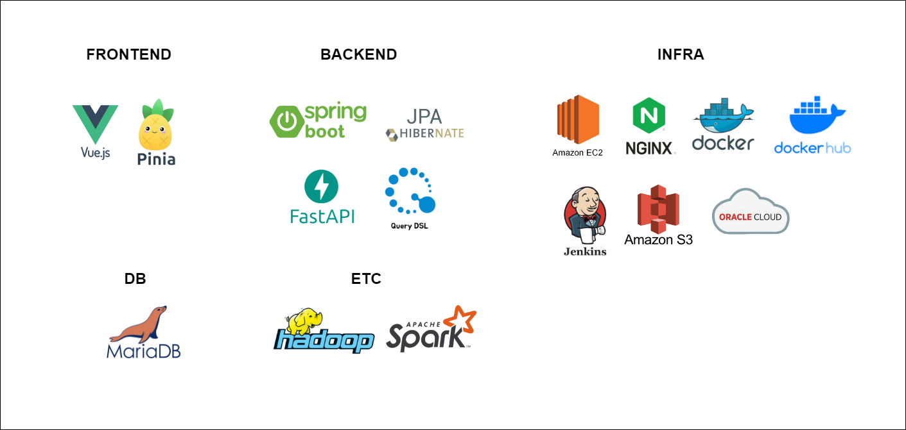
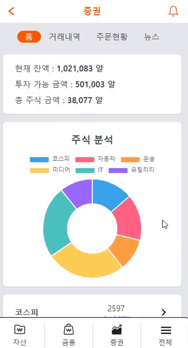
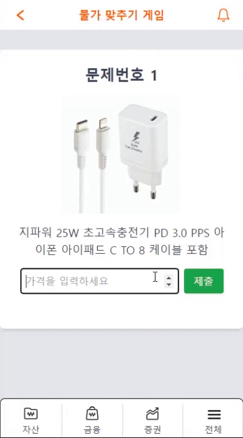
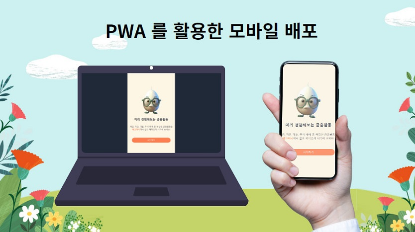
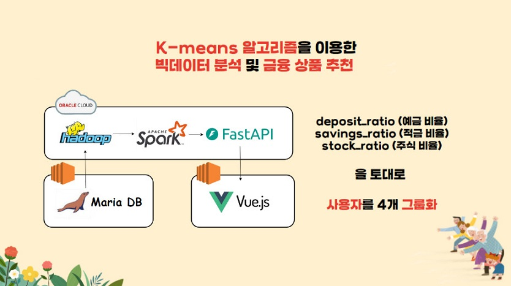
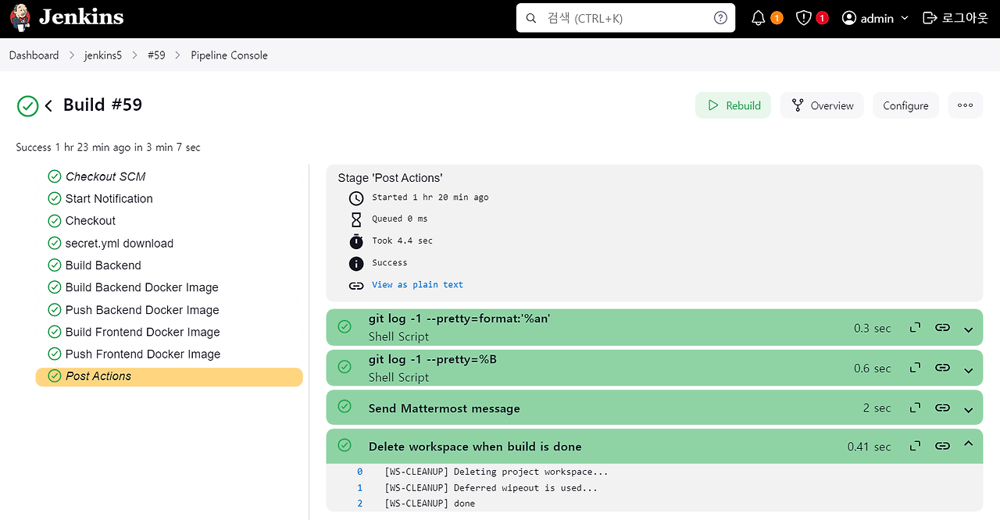
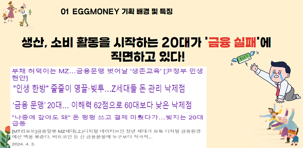
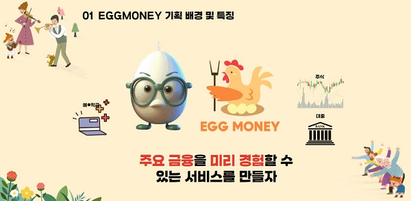
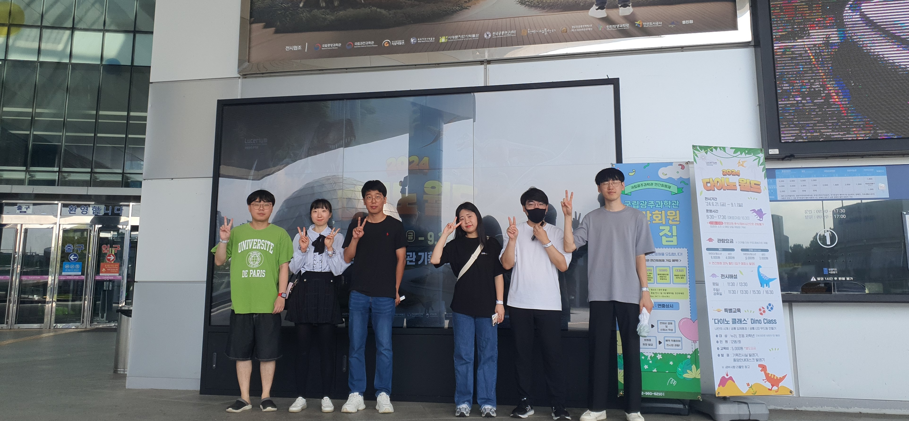

# 🧡🐥 에그머니🧡


##### 프로젝트 기간 
###### 2024.08.19 ~ 2024.10.11 (약 8주)

##### 프로젝트 소개
에그머니는 고등학생 자녀를 대상으로 한 금융 교육 서비스 플랫폼입니다. <br/>
자녀는 부모가 제공한 자금을 바탕으로 투자, 대출, 출금 요청 등을 할 수 있으며, <br/>
이를 통해 사회 진출전 금융 활동의 경험을 쌓게 됩니다. <br/>

##### 주요 기능

1. 금융 API를 이용해 가상 계좌로 자금을 이체 <br/>
2. 실제 주식 시장 데이터를 기반으로 가상 주식 매입/매도 활동 구현 <br/>
3. 예금 적금 상품 조회 및 가입 기능, 대출신청 및 심사 기능 제공<br/>
4. QR 코드를 활용한 가족 연결<br/>
5. GPT를 이용한 뉴스 요약 <br/>
6. K-means 알고리즘을 활용한 금융상품 추천 서비스 <br/>
7. 재미를 위한 이벤트 요소<br/>
경제용어 퀴즈, 행운의 금융 룰렛, 돈 먹기 게임, 물가 맞추기 게임<br/>

---
#### 목차

##### 📊 I. 기술 스택

##### 💁 II. 구현 화면

##### 💻 III. 주요 기술 설명

##### ☄️ IV. 트러블 슈팅  

##### 📑 V. 프로젝트 설계

##### 🐱 VI. 팀원 소개

##### 🙇 VII. 느낀 점 및 참고사항

---
##### 📊 I. 기술 스택



|  | Front | Back | Infra |
| --- | --- | --- |  --- |
| **Language** | TypeScript | Java 17 |  |
| **Framework** | Vue3.js, Pinia | Spring Boot, JPA, QueryDSL, FastAPI |  |
| **Library** | Tailwind, PWA | JWT, JPA, QueryDSL |  |
| **DB** |  | MariaDB |  |
| **Server** |  | Node.js | Amazon EC2, Nginx, Docker, Dockerhub, Oracle Cloud, S3 |
| **CI/CD** |  |  | Jenkins |
| **ETC** | |Spark, Hadoop ||


<details>
<summary>추가 설명</summary>
<div markdown="1">
<br/>


### [ Front ]<br/>
Vue 3.js : 사용자 인터페이스를 구축하기 위한 진보적인 JavaScript 프레임워크로
재사용성과 유지보수성을 높이는 데 중점을 두고 있습니다. 팀원들이 백엔드에 집중하고 싶어하는 만큼 1학기 수업 시간에 배웠기 때문에 보다 친숙한 Vue.js를 기술 스택으로 선택했습니다.  <br/> <br/>
Tailwind CSS : Utility first CSS 프레임워크로,
디자인을 빠르게 prototyping하고 사용자 정의 CSS를 줄이는 데 유용합니다. 기존에 사용하던  CSS보다 좀 더 쉽고 간편하게 화면을 디자인 할 수 있기 때문에 이 기술을 선택하였습니다.  <br/> <br/>
PWA(Progressive Web App) : PWA는 웹사이트의 장점과 네이티브 애플리케이션의 장점을 결합한 형태로, 기존 PC 웹 브라우저에서 만든 화면을 좀 더 쉽고 빠르게 모바일로 변형하기 위해 사용하는 기술입니다. 사용자들이 학생들인 만큼 웹사이트에 대한 접근성을 높이기 위해 모바일 형태의 어플이 필요했습니다.  <br/><br/>

---
### [ back ]<br/>
Spring Boot : Java 기반의 프레임워크이며, 내장 서버와 자동 구성 기능을 제공하여 개발 생산성을 높일 수 있습니다. 한국에서 보편적으로 사용되고 있는 기술이기 때문에 사용하게 되었습니다. <br/> <br/>
Spring Security : 애플리케이션의 보안을 담당하는 프레임워크로, 인증 및 권한 부여 기능을 제공하기 위해 사용하였습니다.<br/> <br/>
JPA (Java Persistence API) : 자바에서 데이터베이스와의 상호작용을 간편하게 해주는 ORM(Object-Relational Mapping) 기술입니다. 데이터베이스의 엔티티를 객체 형태로 매핑하기 위해서 사용하였습니다. <br/> <br/>
JWT (JSON Web Token) : 인증 정보를 안전하게 전송하기 위한 토큰 형식으로, 클라이언트와 서버 간의 인증 및 권한 부여를 간편하게 처리할 수 있도록 도와주기 위해 사용하였습니다.
<br/><br/>

---
### [ DB ]<br/>
MariaDB : DB를 어떤 걸 사용할까 팀에서 많은 논의가 있었습니다. 그 결과 MySQL과 유사하면서도 오픈소스이기에 무료로 사용할 수 있는 Maria DB를 사용하기로 했습니다. 데이터를 좀 더 쉽게 보기 위해서 Maria DB Workbench를 활용하는 멤버도 있었고, Heidi SQL로 DB에 접근하는 멤버도 있었습니다. 기본적으로 개발을 할 때는 local에서 테스트를 진행한 후, 서버에 업로드 하였습니다. 
<br/><br/>
Oracle Cloud : 팀원의 개인 Oracle Cloud입니다. 금융 상품 추천 알고리즘을 구현하기 위해 사용하는 Hadoop, spark, FastAPI를 넣기 위해서 사용했습니다. 메인 EC2 서버에 영향을 최소한으로 주기 위해서 MSA 방식으로 구현을 하는데 사용하였습니다.  
<br/>

---
### [ Infra ]<br/>
Node.js : 서버 측 JavaScript 실행 환경으로, 비동기 I/O 모델을 사용하여 높은 성능과 확장성을 제공합니다. 웹 서버나 API 서버 구축에 적합하여 사용하게 되었습니다. <br/><br/>
Amazon EC2 : 아마존 웹 서비스(AWS)의 클라우드 컴퓨팅 서비스로, 가상 서버를 손쉽게 생성하고 관리할 수 있습니다. 이 프로젝트에서는 EC2를 2개 사용하였는데, 젠킨스가 올라간 서버는 개인 프리티어 계정 EC2이고, NginX가 올라간 EC2는 아카데미에서 제공해주는 EC2를 사용하였습니다. 이 과정에서 깨닫게 된 것은 EC2 용량에 따라 서버의 성능이 꽤 많이 차이가 난다는 것이었습니다. EC2 프리티어도 좋지만, 이것으로는 충분하지 않을 때가 많다는 것을 경험으로 깨닫게 되었습니다. <br/><br/>
Nginx : 고성능 웹 서버 및 리버스 프록시 서버로, 정적 파일 제공합니다. 로드 밸런싱, SSL/TLS 지원 등을 통해 웹 애플리케이션의 성능을 개선할 수 있습니다. 저희는 EC2에 NginX 이미지를 띄워서 사용하였습니다.  <br/><br/>
Docker : 애플리케이션을 컨테이너화하여 배포할 수 있는 플랫폼으로, 개발 환경을 일관되게 유지하고 이식성을 높일 수 있습니다. 배포 환경이 달라지더라도 동일한 성능으로 환경을 다시 설정하기 위해 도입하였습니다. <br/><br/>
Jenkins : 오픈 소스 자동화 서버로, 소프트웨어 개발 과정에서 지속적인 통합(CI)과 지속적인 배포(CD)를 지원하는 도구입니다. 젠킨스를 활용하여 무중단 자동배포를 구현할 수 있었고,빌드 및 배포 시간을 단축할 수 있었습니다. 
<br/><br/>
Amazon S3: 객체 저장 서비스를 제공하는 플랫폼으로, 대량의 데이터를 안전하게 저장하고 관리할 수 있는 기능을 제공합니다. 가족 데이터 관리 시 프로필 이미지를 저장하기 위해 사용하였습니다. 

</div>
</details>
<details>
<summary>협업 도구</summary>
<div markdown="1">

### 1. Git & Github<br/>
분산형 버전 관리 시스템으로<br/>
코드의 변경 사항을 추적하고 여러 개발자 간의 협업을 용이하게 함<br/><br/>


### 2. Jira<br/>
Atlassian에서 개발한 프로젝트 관리 및 이슈 추적 도구<br/>
주로 소프트웨어 개발 팀에서 사용되며, Agile 방법론(스크럼, 칸반 등)을 지원<br/>


### 3. Mattermost <br/>
오픈 소스 팀 채팅 및 협업 플랫폼<br/>
Slack과 유사한 기능을 제공<br/>
자체 서버에 호스팅할 수 있어 보안 및 프라이버시가 중요할 때 유용<br/>


</div>
</details>
<br/>

---
##### 💁 II. 구현 화면


### 1️⃣ 메인페이지 & 로그인, 회원가입 

| 메인페이지| 회원가입 | 
| --- | --- | 
| |  | 

### 2️⃣ 가족등록 

| 가족초대 | 가족등록 | 
| --- | --- | 
|  |  | 

### 3️⃣ 예적금 페이지 

| 예금가입 | 예금해지 | 
| --- | --- | 
|  |  | 

| 적금가입 | 적금납입 | 
| --- | --- | 
|  |  | 

### 4️⃣ 금융 상품 추천페이지 

| 추천1,2 | 추천3,4 | 
| --- | --- | 
|  |  | 

### 5️⃣ 대출 페이지

| 대출심사 | 대출상환 | 
| --- | --- | 
| |  | 

### 6️⃣ 출금 페이지  

| 출금요청 | 출금심사 | 
| --- | --- | 
| |  | 

### 7️⃣ 증권 페이지

| 현재가 거래 | 지정가 거래 | 
| --- | --- | 
| |  | 

| 거래내역, 주문현황 | 뉴스 | 
| --- | --- | 
| |  | 

### 8️⃣ 이벤트  

| 경제용어 퀴즈 | 행운의 금융 룰렛 | 
| --- | --- | 
| |  | 

| 돈 먹기 게임 | 물가 맞추기 게임 | 
| --- | --- | 
| |  | 


[▶ 에그머니 소개 영상](exec/eggmoney.mp4)

[](exec/eggmoney.mp4)

---
##### 💻 III. 주요 기술 설명

<details>
<summary> 1️⃣ 모바일 웹 : PWA (Progressive Web Apps) </summary>
<div markdown="1">

### PWA (Progressive Web Apps)란?

웹 기술을 활용해 네이티브 앱처럼 작동하는 웹 애플리케이션입니다. PWA 기술을 활용하면 PC에서 뿐 아니라 모바일에서도 서비스에 접근할 수 있게 됩니다. 최근에는 PC보다 모바일을 사용하는 경우가 늘어나고 있는데, 이러한 시대의 변화에 맞춰 자녀가 더욱 편리하게 에그머니 서비스를 이용할 수 있도록 하기 위해 PWA 기술을 도입하였습니다.



#### 주요 특징 

1. **오프라인 작동: 언제 어디서나 금융 교육**  
   서비스 워커를 통해 네트워크 연결 없이도 앱을 사용할 수 있어, 자녀가 학교나 외출 중에도 금융 활동을 연습할 수 있습니다. 이를 통해 금융 지식과 경험을 자연스럽게 습득할 수 있습니다.
  
2. **빠른 로딩 속도: 즉각적인 정보 접근**  
   캐싱 기술 덕분에 페이지가 신속하게 로드되어, 자녀가 원하는 금융 정보를 즉시 확인할 수 있습니다. 이로 인해 학습의 흐름이 끊기지 않고, 자녀가 적극적으로 참여하게 됩니다.

3. **푸시 알림: 금융 교육의 지속적인 동기 부여**  
   사용자가 앱을 떠나더라도 알림을 통해 금융 교육과 관련된 중요한 정보를 상기시킬 수 있습니다. 부모와 자녀 간의 소통을 강화하며, 자녀가 금융 교육에 지속적으로 관심을 가질 수 있도록 돕습니다.

4. **반응형 디자인: 다양한 기기에서의 편리한 접근**  
   모든 기기에서 최적화된 경험을 제공하여, 자녀가 스마트폰이나 태블릿으로 언제든지 금융 교육에 접근할 수 있습니다. 이렇게 높아진 접근성은 자녀의 금융 이해도를 높이는 데 기여합니다.

5. **설치 가능: 네이티브 앱처럼 편리하게 사용**  
   PWA를 홈 화면에 추가하여 마치 네이티브 앱처럼 사용할 수 있어, 자녀가 금융 교육 플랫폼에 자주 접근하게 만듭니다. 이는 학습의 연속성을 높이고, 금융 개념을 쉽게 접할 수 있게 합니다.

#### 장점 및 효과

- **크로스 플랫폼 지원: 모든 기기에서의 일관된 경험**  
  iOS, Android, 데스크탑 등 다양한 플랫폼에서 동일한 사용자 경험을 제공하므로, 자녀가 자신의 기기에서 언제든지 금융 활동을 경험할 수 있습니다. 이는 자녀의 금융 교육에 유연성을 부여합니다.

- **유지보수 용이: 지속적인 서비스 개선**  
  하나의 코드베이스로 여러 플랫폼을 지원하므로, 개발자들이 시간과 자원을 효율적으로 사용할 수 있습니다. 이는 서비스의 지속적인 업데이트와 기능 개선을 가능하게 하여, 항상 최신의 금융 교육 콘텐츠를 제공합니다.

- **비용 절감: 추가 기능 개발의 여유**  
  네이티브 앱 개발에 비해 개발 및 배포 비용이 낮아, 추가 기능이나 콘텐츠 개발에 더 많은 자원을 투자할 수 있습니다. 이를 통해 자녀의 금융 교육을 더욱 풍부하게 만들 수 있습니다.

- **사용자 경험 향상: 실생활 금융 지식 적용**  
  빠른 로딩과 오프라인 사용 가능성 덕분에 자녀는 언제 어디서나 금융 교육을 지속할 수 있으며, 이는 실제 생활에서 금융 지식을 적용하는 데 긍정적인 영향을 미칩니다.

- **강화된 참여 유도: 금융 교육에 대한 지속적 관심**  
  푸시 알림을 통해 금융 교육의 중요성을 지속적으로 상기시킬 수 있어, 자녀의 학습 동기를 높이고 금융 교육에 대한 흥미를 유지하는 데 기여합니다.

</div>
</details>


<details>
<summary> 2️⃣ CI/CD 구축 : Blue/Green 배포</summary>

### Blue/Green 배포란?
Blue/Green 배포는 애플리케이션의 새로운 버전을 배포할 때 서비스 중단을 최소화하는 전략입니다. 두 개의 환경(Blue와 Green)을 사용하여 안전하고 원활한 배포를 진행합니다. 


### 이 기술을 선택한 이유

1. **사용자 경험 유지**<br/> 금융 교육과 관련된 서비스는 안정성과 신뢰성이 필수적입니다. Blue/Green 배포를 통해 업데이트 중에도 사용자에게 중단 없는 서비스를 제공할 수 있습니다. 이는 사용자 불만을 최소화하고, 금융 교육의 연속성을 보장합니다.

2. **신속한 롤백 가능성**<br/>금융 서비스는 예기치 않은 오류나 문제가 발생할 경우 즉시 대응해야 합니다. Blue/Green 배포를 통해 새로운 버전에서 문제가 발생하더라도, 빠르게 이전 안정적인 버전으로 롤백할 수 있습니다. 이는 서비스의 안정성을 높이고, 사용자의 신뢰를 유지하는 데 큰 도움이 됩니다.

3. **안전한 배포 테스트**<br/> 새로운 기능이나 업데이트를 배포하기 전에 Green 환경에서 충분히 테스트할 수 있습니다. 이를 통해 성능이나 사용성에 문제가 없는지 확인할 수 있으며, 문제가 발견될 경우 배포를 지연할 수 있습니다.

4. **비교 분석 가능**<br/> 두 환경에서의 성능을 비교하여 최적의 결과를 도출할 수 있습니다. 이를 통해 지속적으로 서비스 품질을 개선하고, 자녀의 금융 교육에 최적화된 기능을 제공할 수 있습니다.

5. **유연한 배포 전략**<br/> 금융 교육 플랫폼은 다양한 기능 업데이트가 필요합니다. Blue/Green 배포는 이러한 변화에 유연하게 대응할 수 있는 배포 전략을 제공하여, 서비스 개선과 사용자의 요구에 신속히 대응할 수 있습니다.

### 주요 특징

- **두 개의 환경**: 하나는 현재 운영 중인 환경(Blue), 다른 하나는 새로운 버전이 배포되는 환경(Green)입니다.

- **신속한 전환**: 새로운 버전이 준비되면 트래픽을 Blue에서 Green으로 전환하여 신속하게 서비스 전환이 가능합니다.

- **롤백 용이**: 새로운 버전이 문제가 발생할 경우, 빠르게 이전 버전으로 롤백할 수 있습니다.

### 장점

- **서비스 중단 최소화**: 사용자에게 거의 영향을 미치지 않고 업데이트를 적용할 수 있습니다.

- **비교 테스트 가능**: 두 환경에서 성능을 비교하여 문제를 조기에 발견할 수 있습니다.

- **신뢰성**: 새로운 기능을 안정적으로 배포할 수 있어 신뢰성을 높일 수 있습니다.

</details>


<details>
<summary>3️⃣ 금융상품 추천 알고리즘: 하둡, 스파크, FastAPI</summary>

### 1. 추천 로직 개요

   

- **정의**: 
  - K-means 알고리즘을 이용하여 3개의 인자(**주식**, **적금**, **예금**)을 사용해서 세 가지 금융 항목에 대한 사용자들의 데이터를 분석합니다. **클러스터링(군집화)**과정이 끝난 후, 군집별 최다 상품을 검색하고 학습이 완료된 모델을 통해 군집별 추천 상품을 제공합니다.
  - 예를 들어, 사용자의 **예금**이 많으면 **예금 클러스터**, **적금**이 많으면 **적금 클러스터**로 분류됩니다.
  - 상품 추천을 요청한 사용자는 클러스터를 분류받고, 해당 클러스터에 해당하는 금융 상품을 제공받게 됩니다.

### 2. 하둡 및 Spark를 활용한 데이터 처리

1. **하둡(Hadoop)**:
   - 매일 **0시**, **MariaDB**의 데이터를 기반으로 하둡에 데이터를 저장하여 학습 모델(**K-means** 알고리즘 모델)을 갱신합니다.
   - 이 과정에서 사용자의 **예금**, **적금**, **주식** 데이터를 추출하여 클러스터링을 위한 입력값으로 사용합니다.

2. **Spark**:
   - Spark는 대규모 데이터를 처리하는 데 특화된 프레임워크로, 데이터를 분산 처리하여 분석합니다.
   - Spark가 사용자에게 맞는 **클러스터 ID(군집 분류)**와 **추천 상품 ID**를 생성하여 **FastAPI**를 통해 반환합니다.

    

    **그래프에 포함된 변수들:**
    - **deposit_ratio**: 사용자의 총 자산 중 예금이 차지하는 비율.
    - **savings_ratio**: 사용자의 총 자산 중 적금이 차지하는 비율.
    - **stock_ratio**: 사용자의 총 자산 중 주식이 차지하는 비율.
    - **prediction**: K-Means 클러스터링 결과로 나온 클러스터 ID.

    **각 그래프의 해석:**
    pairplot에서 만들어지는 9개의 그래프는 아래와 같은 의미를 가집니다.
    1. **deposit_ratio vs deposit_ratio**: 대각선에 위치한 히스토그램: 예금 비율의 분포를 나타냅니다. 클러스터 별로 색상이 구분되며, 각 클러스터의 사용자들이 예금 비율에서 어떻게 분포되어 있는지를 확인할 수 있습니다.
    2. **deposit_ratio vs savings_ratio**: 산점도: 예금 비율과 적금 비율 간의 상관 관계를 나타냅니다. 각 점은 개별 사용자를 나타내며, 색상은 클러스터를 나타냅니다. 특정 클러스터에 속하는 사용자들이 예금과 적금 비율 간에 어떤 패턴을 보이는지 확인할 수 있습니다.
    3. **deposit_ratio vs stock_ratio**: 산점도: 예금 비율과 주식 비율 간의 관계를 나타냅니다. 각 클러스터의 사용자가 예금과 주식에 어떻게 자산을 배분하는지 파악할 수 있습니다.
    4. **savings_ratio vs deposit_ratio**: 2번 그래프와 동일: 대칭적인 pairplot이므로, 해석은 2번과 동일합니다.
    5. **savings_ratio vs savings_ratio**: 대각선에 위치한 히스토그램: 적금 비율의 분포를 보여줍니다. 각 클러스터의 사용자들이 적금 비율에서 어떻게 분포되는지 확인할 수 있습니다.
    6. **savings_ratio vs stock_ratio**: 산점도: 적금 비율과 주식 비율 간의 상관 관계를 나타냅니다. 적금 비율이 높을수록 주식 비율이 낮은 패턴이나, 특정 클러스터의 사용자들이 두 비율 간에 어떤 특징을 보이는지 확인할 수 있습니다.
    7. **stock_ratio vs deposit_ratio**: 3번 그래프와 동일: 대칭적인 pairplot이므로, 해석은 3번과 동일합니다.
    8. **stock_ratio vs savings_ratio**: 6번 그래프와 동일: 대칭적인 pairplot이므로, 해석은 6번과 동일합니다.
    9. **stock_ratio vs stock_ratio**: 대각선에 위치한 히스토그램: 주식 비율의 분포를 나타냅니다. 클러스터 별로 주식 비율의 분포가 어떻게 나뉘어 있는지 확인할 수 있습니다.

3. 클러스터별 해석:
   클러스터링 결과(prediction)에 따라 각 점이 다른 색상으로 구분되어 있으므로, 각 클러스터에 속하는 사용자들의 자산 분포 특성을 파악할 수 있습니다. 예를 들어:

    - **클러스터 0**: 예금 비율이 높고, 적금과 주식 비율이 낮은 사용자들로 구성될 수 있습니다.
    - **클러스터 1**: 적금 비율이 높은 사용자가 많고, 예금과 주식의 비율이 상대적으로 낮은 특성을 보일 수 있습니다.
    - **클러스터 2**: 주식 비율이 다른 자산에 비해 높은 사용자들로 구성될 수 있습니다.

4. **종합적인 해석**:
   이 그래프들은 자산 비율 간의 상관 관계와 클러스터링 결과를 시각적으로 확인할 수 있게 해 줍니다. 사용자의 자산 분포가 어떻게 다른지, 특정 클러스터에서 자산의 비율이 어떻게 나타나는지 확인할 수 있으며, 이를 통해 각 클러스터의 사용자 특성을 파악할 수 있습니다.

### 3. 사용자 유형 분류

- 프론트 페이지에서는 사용자의 금융 데이터 비율에 따라 사용자 유형을 분류합니다.
  - **예금**이 많으면: **안전 제일**.
  - **적금**이 많으면: **꾸준한 저축가**.
  - **주식**이 많으면: **미래의 투자자**.
  - **아무 금융 항목도 없으면**: **초보자**로 분류됩니다.
  
- 이 분류 기준을 바탕으로 맞춤형 금융 상품을 추천하며, 사용자와 유사한 성향의 사용자들이 가장 많이 가진 상품을 제안할 수 있습니다.

### 4. 대출 데이터 처리

- 그동안 **Loan 테이블**에서 승인된 대출 데이터를 기반으로 대출 타입별로 **Group by**하여 대출 이율 평균값을 제시합니다.
- 부모님이 대출 이율 선정에 어려움이 있을 경우, 도움을 주는 지표 역할을 합니다.
- 이 과정에서 생성된 데이터는 자동으로 **하둡(Hadoop)**에 저장되어 계산됩니다.

### 5. 기타 기술적 세부 사항

- **데이터 갱신 주기**: 학습 모델은 매일 0시에 MariaDB에서 추출된 최신 데이터를 기반으로 갱신됩니다. 이를 통해 최신 정보를 반영하여 추천의 정확도를 높입니다.

</details>


<details>
<summary> 4️⃣ 금융 API 활용 : 1원인증 구현</summary>

### 1원인증이란?
사용자가 1원의 금액을 인증을 통해 확인하고, 해당 금액을 통해 사용자 신원을 증명하는 방식입니다. 실제 토스와 같은 금융 기관에서도 자주 활용하고 있는 방법 중 하나입니다. 

  

### 이 기술을 선택한 이유

에그머니 서비스는 자녀의 금융 교육을 목표로 하고 있으며, 이를 위해서는 사용자 신원 확인과 보안이 매우 중요합니다. 이를 위해, 실제 많은 금융권에서 채택하고 있는 1원 인증 방식이 안전하고 신뢰할 수 있는 금융 교육 경험을 제공하는 데 필수적인 기술이라 생각하여 채택하게 되었습니다.

1. **보안성 강화** <br/>
1원 인증을 통해 신원을 확인함으로써, 불법적인 접근을 방지하고 사용자의 안전을 보장할 수 있습니다.

2. **사용자 경험 최적화** <br/>
간편한 인증 절차는 자녀와 부모가 쉽게 접근할 수 있도록 도와줍니다. 복잡한 인증 과정을 줄이고, 금융 교육에 더 집중할 수 있는 환경을 제공합니다.

3. **신뢰 구축** <br/> 부모와 자녀 모두에게 신뢰를 줄 수 있는 시스템입니다. 자녀가 금융 활동을 경험하기 전에 안전하게 인증받을 수 있어, 서비스에 대한 신뢰감을 높입니다.

4. **유연한 통합 가능성** <br/> 다양한 금융 API와의 통합이 용이하므로, 미래에 추가할 수 있는 기능이나 서비스 확장을 위한 기반을 마련할 수 있습니다. 이는 지속적인 서비스 개선에 기여합니다.

5. **적은 비용으로 효과적인 인증** <br/> 소액 결제 방식으로 인해 비용 부담이 적으며, 신원을 증명하는 효과적인 방법을 제공할 수 있습니다. 이는 자원 효율적인 운영에 기여합니다.

### 구현 방식

1. **사용자 요청**: 사용자가 인증 요청을 하여 1원 결제를 시도합니다.

2. **결제 시스템 연동**: 결제 시스템과 연동하여 1원 결제를 진행합니다.

3. **인증 완료**: 결제가 완료되면 인증이 완료된 것으로 간주하고, 사용자는 서비스를 이용할 수 있습니다.

### 장점

- **높은 신뢰성**: 소액 결제를 통해 사용자 신원을 확인함으로써 보안성을 강화합니다.

- **간편한 사용자 경험**: 간단한 인증 절차로 사용자 경험을 개선할 수 있습니다.

- **API 통합**: 공통 API를 통해 다양한 서비스와의 통합이 용이합니다.

</details>

<details>
<summary> 5️⃣ Chat GPT를 활용한 금융 뉴스 요약</summary>
<div markdown="1">

### 에그머니에서는?


최신 금융 뉴스를 효율적으로 수집하고 요약하여 에그머니 사용자, 특히 고등학생 자녀에게 제공하는 것을 목표로 합니다. 자동화된 크롤링 및 요약 프로세스를 통해 정보 접근성을 높이며, 복잡한 뉴스를 쉽게 이해할 수 있도록 변환하는 데 기여합니다. 자녀는 언제든지 최신 금융 뉴스에 대한 정보를 간편하게 얻을 수 있어, 금융에 대한 이해도를 높이고 실제 투자 및 금융 활동에 대한 자신감을 키울 수 있습니다.

### 1. 뉴스 크롤링
- **사용 기술**: [Jsoup](https://jsoup.org/)
- **설명**: Jsoup 라이브러리를 사용하여 네이버 금융 뉴스 섹션(예: `https://news.naver.com/section/101`)에서 최신 뉴스를 크롤링합니다. HTML 문서를 파싱하고, DOM을 탐색하여 뉴스 제목, 링크, 출처를 추출합니다. 이 과정에서 오류가 발생할 수 있는 예외 처리를 포함하여 안정성을 높였습니다.

- **핵심 메서드**: 
    ```java
    @Override
    public List<NewsCrawlResponse> crawlFinanceHeadLineNews() {
        Document document = Jsoup.connect(FINANCE_URL)
                .userAgent(USER_AGENT)
                .get();
        
        Elements headLineNewsElements = document
                .select("div.section_article.as_headline._TEMPLATE ul.sa_list > li");

        // 제목, 링크, 출처 추출
        for (Element headLineElement : headLineNewsElements) {
            String title = headLineElement.selectFirst("div.sa_text > a").text();
            String link = headLineElement.selectFirst("div.sa_text > a").attr("href");
            String press = headLineElement.selectFirst("div.sa_text_press").text();

            newsInfos.add(new NewsCrawlResponse(title, link, press));
        }

        return newsInfos;
    }
    ```
- **예외 처리**: 크롤링 과정에서 `IOException`이 발생할 수 있으며, 이를 로깅하여 문제 발생 시 디버깅에 도움을 줍니다. 헤드라인 뉴스가 없는 경우에도 경고 로그를 기록합니다.

### 2. 뉴스 내용 요약
- **사용 기술**: [OpenAI GPT](https://openai.com/)
- **설명**: 크롤링한 뉴스의 내용을 OpenAI API를 통해 요약합니다. 사용자가 이해하기 쉬운 형태로 요약하기 위해 "너는 경제 뉴스를 고등학생이 이해할 수 있도록 요약해주는 전문 기자야"라는 프롬프트를 설정합니다. 이 과정을 통해 사용자는 복잡한 금융 뉴스를 간결하게 파악할 수 있습니다.

- **핵심 메서드**:
    ```java
    @Override
    public SummarizedContentResponse summarizeNews(String newsContent) {
        Map<String, Object> requestBody = new HashMap<>();
        requestBody.put("model", "gpt-4o-mini");
        requestBody.put("max_tokens", 700);
        requestBody.put("temperature", 0.3);
        requestBody.put("messages", new Object[] {
                Map.of("role", "system", "content", "너는 경제 뉴스를 고등학생이 이해할 수 있도록 요약해주는 전문 기자야"),
                Map.of("role", "user", "content", newsContent)
        });

        return this.webClient.post()
                .uri("https://api.openai.com/v1/chat/completions")
                .header("Authorization", "Bearer " + openAIConfig.getApiKey())
                .bodyValue(requestBody)
                .retrieve()
                .bodyToMono(OpenAIResponse.class)
                .map(response -> {
                    String content = response.getChoices().get(0).getMessage().getContent();
                    return new SummarizedContentResponse(response.getId(), content);
                })
                .block();
    }
    ```
- **요약 결과 처리**: 요약된 결과는 사용자가 쉽게 이해할 수 있도록 변환된 후, 저장하거나 사용자에게 전달하는 등의 추가 처리로 이어질 수 있습니다.

### 3. 스케줄링
- **사용 기술**: [Spring Scheduler](https://docs.spring.io/spring-framework/docs/current/reference/html/integration.html#scheduling)
- **설명**: Spring의 스케줄링 기능을 활용하여 매일 특정 시간(예: 4시 55분)에 뉴스 크롤링 및 요약 작업을 자동으로 수행합니다. 이를 통해 반복적인 작업을 자동화하고, 사용자가 항상 최신 뉴스를 받을 수 있도록 합니다. CRON 표현식을 사용하여 정확한 시간에 작업을 수행할 수 있습니다.

- **핵심 메서드**:
    ```java
    @Scheduled(cron = "0 55 4 * * *", zone = "Asia/Seoul")
    public void scheduledNewsCrawlingAndSummarization() {
        List<NewsCrawlResponse> newsList = crawlFinanceHeadLineNews();
        for (NewsCrawlResponse news : newsList) {
            String content = crawlNewsContent(news.getLink());
            SummarizedContentResponse summary = summarizeNews(content);
        }
    }
    ```
- **유연성**: 스케줄링 설정은 환경에 따라 조정 가능하며, 필요에 따라 다양한 시간 주기로 설정할 수 있습니다.


</div>
</details>


---
##### ☄️ IV. 트러블 슈팅  

<details>
<summary> 1️⃣ Git Revert Trouble Shooting </summary>
<div markdown="1">

#### 문제상황

Merge를 취소하려고, Revert를 여러번 반복해서<br/> back쪽 코드들이 이전으로 돌아가게 되었습니다.


#### 해결방안 

back 폴더를 지운 후, 이전 로그 번호로 되돌리는 방식으로 해결했습니다.
Front 수정 코드는 로컬에 있기 때문에, 이것만 해결하면 되었습니다.

#### 참고
`git reset` 명령어로 특정 커밋(`cfc2fb2b`)로 되돌릴 수 있습니다.
**`-hard` 옵션**: 해당 커밋으로 작업 디렉토리, 인덱스, HEAD를 모두 되돌립니다. 다만, 현재 작업 중인 파일의 변경 사항도 모두 사라지니 주의해야 합니다.

```bash

git reset --hard cfc2fb2b

```

</div>
</details>

<details>
<summary> 2️⃣ 젠킨스 authorized_keys 설정 에러</summary>
<br/>

#### 문제상황


```bash

ssh -o StrictHostKeyChecking=no deployuser@j11c204.p.ssafy.io "bash /home/deployuser/deploy_back.sh"
Shell Script
5.3 sec
+ ssh -o StrictHostKeyChecking=no deployuser@j11c204.p.ssafy.io bash /home/deployuser/deploy_back.sh
Warning: Permanently added 'j11c204.p.ssafy.io' (ED25519) to the list of known hosts.
deployuser@j11c204.p.ssafy.io: Permission denied (publickey).
script returned exit code 255

```
#### 해결방안 
Jenkins 서버에서 deployuser를 사용하여 운영 서버에 SSH로 접근하기 <br/>
1.deployuser 사용자 추가
```bash
sudo adduser deployuser
```


2.deployuser 사용자에 대한 .ssh/authorized_keys 파일 설정<br/>
(1) deployuser 사용자로 전환
```bash
sudo su - deployuser
```
(2) .ssh 디렉토리를 생성하고 권한을 설정
```bash
mkdir -p ~/.ssh 
chmod 700 ~/.ssh
```
(3) authorized_keys 파일을 생성
```bash
touch ~/.ssh/authorized_keys 
chmod 600 ~/.ssh/authorized_keys
```
3.Jenkins 서버에서 공개키 생성<br/>
(1) SSH 키 생성<br/>
/root/.ssh 디렉토리에 SSH 키가 없으면 새로 생성해야 함
```bash
 ssh-keygen -t rsa -b 4096 -C "your_email@example.com"
```
(2) Jenkins 서버의 SSH 공개 키를 authorized_keys에 추가
```bash
 cat ~/.ssh/id_rsa.pub
```
4.SSH를 통해 deployuser 계정으로 접근 후 테스트
```bash
ssh deployuser@{운영서버 IP} 
```
5.서버의 SSH 설정 확인<br/>
(1) /etc/ssh/sshd_config <br/>
운영 서버에 접속한 후, SSH 설정 파일 열기
```bash
sudo nano /etc/ssh/sshd_config
```
(2) SSH 서버가 공개 키 인증을 허용하고 있는지 확인<br/>
없으면, 맨 아래줄에 추가
```bash
PubkeyAuthentication yes
```
(3) 설정 변경 후 SSH 서비스를 재시작<br/>
이 단계들을 수행하면 Jenkins 서버에서 deployuser를 사용하여 운영 서버에 SSH로 접근할 수 있게 된다
```bash
sudo systemctl restart ssh
```
#### 젠킨스





#### Front 배포 성공


#### Maria DB 데이터


#### 백엔드 배포 성공


</details>

<details>
<summary>3️⃣ 끝장 토론 : Git 브랜치 배포 전략 선택</summary>
<div markdown="1">

### 문제상황 
원래라면 테스트 서버가 따로 있어서 거기서 테스트 해봐야 한다. 그런데 에그머니를 개발할 당시에는 테스트 서버가 없었기 때문에, 임시방편으로 실서버를 테스트서버로 사용하다보니 문제가 발생했다.

### 해결방안
테스트 서버와 실서버를 **겸용**하는 상황에서는 안정성과 빠른 피드백 모두를 고려한 **깃 전략**이 필요하다. 완벽히 분리된 테스트 환경이 없기 때문에, 이 상황에 맞는 배포 전략을 선택해야했다.

### 🔷 **1. 단순화된 GitHub Flow**
GitHub Flow의 단순화된 버전으로, 하나의 **메인 브랜치**와 **기능 브랜치**로 운영하며, 변경 사항을 실서버 겸 테스트 서버에 바로 배포하는 전략이다.

1. **Main 브랜치 (또는 Master 브랜치)**  
   - **실서버에 배포되는 안정된 코드**가 포함된다. 모든 기능 개발이 완료되고 테스트된 후 이 브랜치로 병합한다.
   
2. **Feature 브랜치**  
   - 각 기능 개발을 위한 브랜치로, 개발이 완료되면 Main 브랜치로 Pull Request를 보낸다.
   - 실서버에서 테스트가 필요하다면 이 기능 브랜치를 직접 배포하여 테스트할 수 있다.

**운영 방식**:
- **기능 개발 시**: Feature 브랜치를 생성해 새로운 기능을 개발한다.
- **테스트 시**: 실서버에서 테스트를 진행해야 하므로, Feature 브랜치를 실서버에 직접 배포하여 실시간으로 테스트를 진행한다.
- **병합 시**: 테스트가 완료되면 Main 브랜치에 병합한다. 이때, 병합한 코드는 곧바로 실서버에 배포가 된다.

**장점**:
- 간단한 구조로 브랜치 관리가 쉽다.
- 실서버에서 테스트가 가능하므로 테스트 환경을 따로 만들 필요가 없다.
- 빠른 배포와 피드백을 받을 수 있다.

**단점**:
- 실서버에서 발생할 수 있는 불안정성 문제를 감수해야 한다.
- 기능 테스트가 완료되지 않은 상태에서 실서버에 배포되는 경우가 발생할 수 있다.

### 🔷 **2. Feature 브랜치 직접 배포 전략**
기능 개발과 테스트를 동시에 실서버에서 수행해야 하는 상황에서는 **Feature 브랜치**를 직접 실서버에 배포하고, 문제가 없을 때 Main 브랜치에 병합하는 전략도 유용하다.

1. **Main 브랜치**  
   - 실서버에서 안정적으로 동작하는 코드가 포함된 브랜치이다.
   
2. **Feature 브랜치**  
   - 새로운 기능을 개발하고 실서버에 직접 배포해 테스트할 수 있는 브랜치이다.

**운영 방식**:
- **기능 개발**: 각 기능에 대해 Feature 브랜치를 생성한다.
- **실서버 배포 및 테스트**: Feature 브랜치를 실서버에 직접 배포하여 기능 테스트를 진행한다.
- **병합 및 배포**: 기능 테스트가 성공적으로 끝나면, 해당 브랜치를 Main 브랜치로 병합하고 다시 실서버에 배포한다.

**장점**:
- 실서버에서 직접 테스트할 수 있어 빠르게 피드백을 받을 수 있다.
- 간소화된 브랜치 구조로, 복잡한 브랜치 관리를 피할 수 있다.

**단점**:
- 테스트가 완료되지 않은 상태에서도 실서버에 코드가 배포되므로 불안정할 수 있다.
- 실서버에서 테스트하는 과정에서 사용자에게 영향을 줄 가능성이 있다.

### 🔷 **3. Develop 브랜치 기반 전략**
테스트와 실서버 배포를 겸용하는 경우, 간소화된 **Develop 브랜치**를 중심으로 운영하는 방식이다.

1. **Main 브랜치**  
   - 실서버에서 안정적으로 운영될 코드가 포함된 브랜치이다.
   
2. **Develop 브랜치**  
   - 개발과 테스트가 동시에 이루어지는 브랜치. Develop 브랜치의 코드를 실서버에 배포하여 테스트할 수 있다.

3. **Feature 브랜치**  
   - 각 기능을 독립적으로 개발하는 브랜치로, 완료되면 Develop 브랜치에 병합하여 실서버에서 테스트를 진행한다.

**운영 방식**:
- **기능 개발**: Feature 브랜치를 생성해 개발을 진행하고, 완료되면 Develop 브랜치에 병합한다.
- **실서버 배포 및 테스트**: Develop 브랜치에 병합된 코드를 실서버에 배포해 테스트한다.
- **병합 및 배포**: 모든 테스트가 성공적으로 끝나면 Develop 브랜치를 Main 브랜치에 병합하여 안정적인 코드를 실서버에 배포한다.

**장점**:
- 개발 및 테스트를 한 브랜치에서 관리할 수 있어 배포 과정이 단순하다.
- Develop 브랜치에서 충분히 테스트를 거친 코드를 Main 브랜치에 병합하므로 안정성이 높다.

**단점**:
- Develop 브랜치의 코드가 실서버에 바로 반영되므로 예상치 못한 오류가 발생할 수 있다.


---

### 💡 **고려해야 할 사항**
1. **프로젝트의 성격**: 빠른 배포와 지속적인 사용자 피드백이 중요한 프로젝트라면 `develop` 브랜치에서의 배포가 더 적합할 수 있다. 반면, 안정성이 가장 중요한 경우에는 `master` 브랜치에서 배포하는 것이 더 안전하다.
  
2. **테스트 환경**: 현재 테스트 서버가 따로 없는 상황이라 실서버를 임시로 테스트 서버로 사용하고 있다. 따라서 develop에서 배포하는 서비스는 없을 것으로 예상된다. 하지만, 향후 테스트 서버를 따로 두고 이를 `develop` 브랜치로 활용하는 전략은 유효할 수 있다.

3. **배포 빈도**: 배포 빈도가 높을 경우 `develop`에서의 배포가 효율적일 수 있다. 하지만 주기적인 릴리즈 사이클을 유지한다면 `master`가 더 적합할 수 있다.

---

### 결론
#### ⇒ Develop 브랜치 기반 전략을 사용하기로 함.

팀원들과의 심도 깊은 논의 끝에, 문제가 발생할 때마다 오류를 신속하게 발견하는 것이 중요하다는 결론에 도달했다. **Develop 브랜치 기반 전략**을 따라 빠르게 개발을 진행하기로 결정했다. 단, 젠킨스 파이프라인이 완성되기 전까지는 `front/infra`라는 별도의 브랜치를 만들어 테스트를 진행하였다. 

#### ✅ 추가 고려 사항

1. **테스트 자동화**:
   - 배포 전에 충분한 테스트를 수행하기 위해 CI/CD 파이프라인을 구축하기.

2. **모니터링 및 롤백 전략**:
   - 배포 후 문제가 발생할 경우를 대비해 모니터링 시스템을 구축하고, 신속하게 롤백할 수 있는 방법도 마련한다.

4. **문서화**:
   - 배포 절차와 관련된 모든 내용을 문서화하여 팀원들이 쉽게 접근하고 이해할 수 있도록 하기
   - 이는 향후 배포를 재개할 때 큰 도움이 될 수 있음.

</div>
</details>


---
##### 📑 V. 프로젝트 설계

<details>
<summary> 🗂️ 기획 배경  </summary>
<div markdown="1">

### "실질적인 삶의 문제"를 해결하기 위한 서비스, 에그머니 🐣








<br/>
</div>
</details>

<details>
<summary> 🗂️ 요구사항 명세 </summary>
<div markdown="1">
<br/>
	

</div>
</details>
<details>
<summary> 🗂️ 기능 명세  </summary>
<div markdown="1">
	


</div>
</details>

<details>
<summary> 🗂️ API 명세  </summary>
<div markdown="1">
	


</div>
</details>

<details>
<summary>🎨 Figma  </summary>
<div markdown="1">

### 에그머니의 피그마는?
저희는 Full Stack 6명이 모인 만큼 피그마도 **멤버들 모두**가 함께 모여서 작성하였습니다. 모든 페이지들을 6개의 부분으로 나눈 후, 하나로 합치는 과정을 거쳤습니다. 이 후 이것들을 UserFlow에 따라 정렬한 뒤 Prototype에서 On click Connection을 진행하였습니다.

 

<!-- [📎 Figma Link  ](https://www.figma.com/design/E4YJ6rv2618zTQV5R0jBPp/C204%ED%8C%80?t=e62ogsR1DgnWEkqL-0) -->

|이름|역할|
|---|---|
|곽재은|홈, 주식 매수 & 매도<br/> 뉴스 페이지|
|김신범|입출금 계좌|
|나경준|가족 생성, 등록, 연결<br/>계좌 출금<br/>404페이지|
|정소영|예금 적금 가입 & 납입 <br/> 대출 신청, 대출 심사|
|정지영|전체 페이지<br/>계좌 등록, 간편 비밀번호, 1원 인증 |
|황우성|메인 페이지<br/>로그인, 로그아웃, 회원가입|


### User Flow에 따른 최종 피그마 배치

|부모님 계정👨‍👩‍👦❣️|
|---|
||

|자녀 계정👧❣️|
|---|
||

</div>
</details>

<details>
<summary>&#128195; ERD  </summary>
<div markdown="1">

### 에그머니의 ERD는?
**6명의 멤버들**이 모두 함께 모여서 작성하였습니다. 서비스의 기능이 다양한 만큼 테이블을 여러개로 구성하였으며, 복잡한 금융 활동을 관리하기 위해 여러번의 피드백 단계를 거쳤습니다. <br/>


### 주요 엔터티 및 관계

### 1. **User (사용자)**
- 부모와 자녀 정보를 저장하는 테이블입니다.
- 필드: `user_id`, `name`, `email`, `password`, `role` (부모/자녀).
- **관계**: `Family` 테이블을 통해 부모와 자녀 간의 1:N 관계를 가집니다.

### 2. **Account (가상 계좌)**
- 각 사용자는 가상 계좌를 가지며, `account_id`와 `user_id`로 구별됩니다.
- 필드: `account_id`, `balance`, `created_at`, 등.
- **관계**: `User`와 1:1 관계를 가집니다.

### 3. **Transaction (거래 내역)**
- 각 계좌와 관련된 거래 내역을 기록하는 테이블입니다.
- 필드: `transaction_id`, `account_id`, `amount`, `transaction_type`, `timestamp`.
- **관계**: `Account`와 N:1 관계를 가집니다.

### 4. **Loan (대출)**
- 대출 관련 정보를 저장하는 테이블입니다.
- 필드: `loan_id`, `user_id`, `loan_amount`, `interest_rate`, `repayment_date`.
- **관계**: `User`와 N:1 관계를 가집니다.

### 5. **Stock (주식)**
- 주식 정보를 저장하는 테이블입니다.
- 필드: `stock_id`, `stock_name`, `current_price`, `created_at`, 등.
- **관계**: `StockTrade`, `StockPrice`, `StockPending`과 연결되어 주식 매입/매도 활동을 추적합니다.

### 6. **Savings (예금)**
- 사용자가 가입한 예금 상품 정보를 저장하는 테이블입니다.
- 필드: `saving_id`, `saving_product_id`, `user_id`, `interest_rate`, 등.
- **관계**: `User`와 N:1 관계를 가집니다.

### 7. **Deposit (적금)**
- 정기 적금 상품 정보를 저장하는 테이블입니다.
- 필드: `deposit_id`, `deposit_product_id`, `user_id`, `balance`, 등.

### 8. **Allowance (용돈)**
- 부모가 자녀에게 지급하는 용돈 정보를 기록합니다.
- 필드: `allowance_id`, `user_id`, `amount`, `allowance_period`.

### 9. **Withdrawal (출금)**
- 사용자의 출금 요청 및 이력을 기록합니다.
- 필드: `withdrawal_id`, `user_id`, `amount`, `status`.

### 10. **News (뉴스)**
- 금융 관련 뉴스 데이터를 저장하며, GPT를 통한 요약 기능이 적용될 수 있습니다.
- 필드: `news_id`, `title`, `content`, `created_at`.

## 관계 요약
- **User와 Account**: 1:1 관계로, 각 사용자는 고유한 가상 계좌를 가집니다.
- **User와 Family**: 1:N 관계로, 부모와 자녀가 `Family` 엔터티를 통해 연결됩니다.
- **Account와 Transaction**: 1:N 관계로, 각 계좌의 여러 거래 내역이 기록됩니다.
- **User와 Loan/Savings/Deposit**: 1:N 관계로, 사용자는 다양한 금융 상품을 이용할 수 있습니다.
- **Stock**: 실시간 주식 거래가 구현되어 있으며, `StockPrice`에 가격 변동이 기록되고 `StockTrade`에 매매 활동이 기록됩니다.
<br/>

</div>
</details>

<details>
<summary> &#128217; Architecture  </summary>
<div markdown="1">

### 에그머니 서비스는?
**Blue-Green 배포** 방식을 활용한 무중단 배포를 실현하고 있으며,<br/> 
**Docker 기반의 배포 환경** 을 통해 <br/>애플리케이션의 독립적 실행과 관리를 용이하게 만들었습니다.

  


### 아키텍처 동작 과정

1. **코드 푸시**: 개발자가 GitLab에 코드를 푸시합니다.
2. **CI/CD 파이프라인 실행**: Jenkins가 이를 감지하여 CI/CD 파이프라인을 실행합니다.
3. **Docker 이미지 빌드 및 배포**: Jenkins는 Docker 이미지를 빌드하고 Docker Hub에 푸시한 후, Nginx를 통해 Blue/Green 환경에 배포합니다.
4. **트래픽 라우팅**: Nginx가 트래픽을 Blue 또는 Green 환경으로 라우팅합니다.
5. **데이터 처리**: FastAPI, Hadoop, Spark는 데이터 처리와 분석 작업을 수행합니다.
6. **클라우드 자원 연결**: Oracle Cloud와 AWS S3를 사용하여 외부 스토리지 및 클라우드 자원을 활용합니다.

### 장점 및 특징

- **무중단 배포**: Blue-Green 배포 방식을 통해 업데이트 중에도 애플리케이션 서비스가 중단되지 않습니다.
- **Docker 기반 배포**: Docker로 애플리케이션을 독립적이고 일관성 있게 배포할 수 있습니다.
- **대규모 데이터 처리**: FastAPI와 Spark를 활용하여, 대량의 데이터를 처리하는 백엔드 시스템을 지원하였습니다.

### 주요 구성 요소

1. **사용자 (Client)** <br/>
   - 사용자의 요청은 Nginx 서버를 통해 애플리케이션으로 전달됩니다.

2. **Nginx** <br/>
   - **로드 밸런서**로서 Blue 또는 Green 환경으로 트래픽을 라우팅합니다.
   - Blue와 Green 두 개의 환경을 번갈아 가며 **무중단 배포**를 수행하며, 하나의 환경이 항상 활성화되어 요청을 처리합니다.

3. **Blue-Green Deployment (Blue와 Green 환경)** <br/>
   - **Green 환경**: Vue.js 기반 프론트엔드와 Spring Boot 백엔드가 Docker 컨테이너로 실행됩니다.
   - **Blue 환경**: Green과 동일한 구성으로, 업데이트 또는 유지보수 시 롤링 업데이트와 무중단 배포를 담당합니다.
   - 두 환경 간 **스위칭**을 통해 업데이트 중에도 서비스가 중단 없이 운영됩니다.

4. **Docker** <br/>
   - Vue.js 프론트엔드와 Spring Boot 백엔드가 각각 Docker 컨테이너로 실행됩니다.
   - **Docker Hub**에서 이미지를 가져와 실행하며, 환경 간 일관성과 독립성을 보장합니다.

5. **Jenkins** <br/>
   - CI/CD 파이프라인을 관리하는 Jenkins가 Docker 컨테이너로 실행 중입니다.
   - 개발자가 GitLab에 코드를 푸시하면 Jenkins가 이를 감지해 **Docker 이미지**를 빌드, **Docker Hub**에 푸시한 후 배포를 진행합니다.
   - Blue-Green 배포 전략을 사용하여 **무중단 배포**를 수행합니다.

6. **GitLab** <br/>
   - 소스 코드 관리를 위해 **GitLab**을 사용하며, 코드 푸시 시 Jenkins가 이를 빌드 및 배포합니다.

7. **FastAPI + Hadoop + Spark (데이터 처리)** <br/>
   - FastAPI가 백엔드에서 금융 상품 추천 데이터 처리를 위한 API를 제공합니다.
   - Hadoop과 Spark는 예금 비율, 적금 비율, 주식 비율의 데이터를 가져와 분석한 후 사용자를 4개로 그룹화하기 위해서 사용되었습니다. 

8. **Oracle Cloud** <br/>
   - Oracle Cloud는 외부 클라우드 인프라로, 금융 상품 추천 서비스의 DB를 운영하는 데 활용됩니다.

9. **AWS S3** <br/>
   - 가족 프로필 이미지는 **AWS S3**에 저장되며, Nginx를 통해 해당 파일에 접근할 수 있게 구성하였습니다. 

<br/>
</div>
</details>

---
##### 🐱 VI. 팀원 소개
### Full Stack 6명



| 이름 | 역할 |   
| --- | --- |
| 나경준 | [팀장] <br/> 카카오 소셜 로그인 기능 <br/>회원 관리 로직 제작 <br/> QR코드를 활용한 가족 연결 기능<br/>간편 비밀번호 제작 <br/> 입금계좌 등록 및 1원 인증 기능 구현<br/> S3를 활용한 이미지 데이터 관리 <br/> 알림 기능 프런트 페이지 (예적금 가입, 대출 심사, 출금 요청 등) <br/>전문가 리뷰 사전질문 및 멘토-멘티 활동일지 작성 <br/>  PPT 제작 및 프로젝트 발표 <br/> 베스트 멤버 선정 | 
| 곽재은 | 주식 분석 및 종목 확인 기능 (차트 포함) <br/> 주식 매수 및 매도 기능 (거래내역 및 주문현황) <br/> Vue.js 공통 컴포넌트 제작, PWA 설정 <br/> 팀 내 컨벤션 관리 및 Code Formatting 담당 <br/> UCC 서포트| 
| 김신범 | 주식 분석 및 종목 확인 기능 (차트 포함)  <br/> 주식 매수 및 매도 기능 (거래내역 및 주문현황)<br/>주식 테이블 설계 최적화<br/>지정가 거래 예약 기능<br/>주식 가격 업데이트(CRON 활용, 매일 4시 50분에 자동 진행)  <br/>알림 기능 (저장, 리스트 불러오기, 읽음여부 확인)<br/>  Chat GPT를 활용한 뉴스 요약 (매일 4시55분에 데이터 load 스케줄링 기능 포함) <br/> Jira 관리 및 작성 독려| 
| 정지영 &nbsp; | 입금 계좌 관리 기능  <br/>출금 신청 및 심사 기능<br/>예금, 적금 가입 및 해지  <br/> 예적금 상품 CRUD  <br/>  대출 신청 및 심사 기능<br/>원리금균등상환, 만기일시상환 기능 구현 <br/> 자산 분석 및 자산추이 그래프 구현 <br/>UCC 제작, ERD 회의 기록 |
| 황우성 | 입금 계좌 관리 기능  <br/>출금 신청 및 심사 기능<br/>예금, 적금 가입 및 해지 <br/>예적금 상품 CRUD  <br/> SSAFY 공동망 API 기반 계좌 이체 기능 구현<br/>대출 신청 및 심사 기능<br/> 자산 분석 및 자산추이 그래프 구현 <br/>HADOOP, Spark 기반 개인 맞춤 상품 추천 알고리즘 구현 (빅데이터 분산 처리) <br/>-> K-means 알고리즘 활용 군집화 (초보자, 안전 제일, 꾸준한 저축가, 미래의 투자가)<br/> Oracle Cloud 서버 기반 FASTAPI를 활용한 빅데이터 활용 서비스 제공<br/>경제 용어 퀴즈 백로직 구현<br/>인프라 서포트 |  
| 정소영 | 인프라 CI/CD 구축<br/>Architecturet설계 및 Porting Manual 작성 <br/> 회원 관리& 전체 페이지 <br/> 이벤트 담당 (경제 용어 퀴즈, 행운의 금융 룰렛, 돈 먹기 게임, 물가 맞추기 게임)<br/>DailyScrum 및 팀 회의 기록 정리 <br/> README 작성 |  

---
##### 🙇 VII. 느낀 점 및 참고사항


<details>
<summary> 그라운드 룰 </summary> 
<div markdown="1">

### 생활 수칙 🐥❣

1. 아침에 올 때 서로 인사하기
2. 입실 & 퇴실 챙겨주기
3. 공지 확인하면 체크 이모지 달기

### 좋았던 룰 & 이유

1. 서로 칭찬 많이 해주기 
2. 서운한 거 있을 때 바로 말해주기
3. 어려운 문제 발생 시, 서로 공유해서 해결하기

### 보완할 룰 & 이유

1. 아침에 반갑게 인사하기 
2. MM 잘 확인하기 
3. 코드 작성할 때 주석 작성하고 코드 작성하기
4. 문서 작성할 때 꼼꼼하게 하기

### 추가하고 싶은 룰

1. 개인 일정 있을 때 미리 말해주기
2. 취업 정보 공유하기
3. 간단한 TIL 작성을 통한, 오늘 본인이 한 일 공유
4. 팀 프로젝트의 진행에 있어, 특별한 사유가 없다면, 빠른 진행이 가능한 방향을 선택하기
5. 회의 시 1인 1아이디어 내기
6. 적극적으로 참여하기
7. 딱딱한 분위기를 희석시켜 줄 수 있는 이벤트 룰
8. 말 많이하기

</div>
</details>

| 이름 | 느낀점 |   
| --- | --- |
| 나경준 &nbsp;&nbsp;&nbsp;&nbsp;&nbsp;&nbsp;&nbsp;&nbsp;&nbsp;&nbsp; | 이번 프로젝트에서 팀장을 맡으면서 많은 도전과 배움을 얻을 수 있었습니다. 특히 소셜 로그인 기능을 구현하는 과정에서 OAuth 인증 방식에 대해 깊이 이해하게 되었고, 다양한 회원 관련 기능을 팀원들과 함께 개발하며 협업의 중요성을 실감했습니다. 팀원들과 적극적으로 소통하고 의견을 조율하는 과정에서 리더십과 책임감을 키울 수 있었던 것이 큰 성장의 계기가 되었습니다. 마지막 발표 준비 과정에서도 각자의 역할을 최대한 반영하려고 노력했고, 그 덕분에 팀 전체가 단단하게 하나로 뭉쳤다는 느낌을 받았습니다. | 
| 곽재은 | PWA(프로그레시브 웹 앱) 셋업과 주식 기능 구현을 맡으면서 프론트엔드와 서버 사이의 데이터 흐름을 원활하게 처리하는 것이 매우 중요하다는 것을 깨달았습니다. 특히 공통 컴포넌트 개발을 통해 유지보수의 편리함과 재사용성의 가치를 실감할 수 있었습니다. 알림 기능을 구현하면서 사용자 경험(UX)에도 신경을 많이 쓰게 되었고, 작은 부분이라도 사용자의 입장에서 생각하는 습관을 기를 수 있었습니다. 이번 프로젝트는 개발 실력을 한층 더 성장시킬 수 있는 좋은 기회였고, 팀원들과의 협업도 매우 즐거웠습니다. | 
| 김신범 | 주식 기능을 담당하며 주식 데이터 API와의 연동 부분이 생각보다 까다로웠습니다. 이를 해결하면서 API를 어떻게 효율적으로 관리하고 성능을 최적화할 수 있을지 고민하는 시간이 많았던 것 같습니다. 또한, Spring Boot의 기본 셋업을 진행하면서 서버 환경 구성을 처음부터 끝까지 경험해볼 수 있었고, 백엔드의 중요한 역할을 다시 한번 깨닫게 되었습니다. 이 프로젝트를 통해 기술적인 부분 외에도 팀과의 협력, 의견 조율에서 많은 배움을 얻었습니다. 앞으로도 이런 경험을 바탕으로 더 나은 개발자가 되고 싶습니다. | 
| 정지영 | 자산 및 금융 관련 기능을 개발하면서 데이터베이스 구조와 효율적인 쿼리 작성의 중요성을 느꼈습니다. 또한, Spring Boot와 DB의 기본 셋팅을 맡으면서 서버와 데이터베이스가 유기적으로 연결되어야 한다는 점을 다시 한번 깨달았고, 데이터 일관성을 유지하기 위한 방법들을 고민하게 되었습니다. UCC 제작도 진행하며 개발 외적인 부분에서도 창의성을 발휘할 수 있었던 점이 재미있었습니다. 팀원들과의 협업 과정에서 얻은 소중한 경험들이 앞으로도 큰 자산이 될 것 같습니다. | 
| 황우성 | 금융 서비스와 로직을 개발하면서 느낀 것은 기능 개발에 대한 어려움보다는 세세한 예외 처리와 트랜잭션 처리가 상당히 어렵다는 것이었습니다. 때문에 예외처리 및 테스트에 많은 시간을 들였습니다. 아쉬운 점은 프론트 페이지 구현 작업량이 많아 TDD(테스트 기반 개발)을 못해본 것이 아쉽습니다. 잘된 점은 이번 프로젝트를 통해서 사용해보지 못했던 HADOOP, SPARK를 이용한 빅데이터 분산 처리를 활용한 서비스 구현을 경험해 볼 수 있어 좋았습니다. 저는 이번 프로젝트를 통해 공동망 API를 활용하여 실제 계좌를 관리하는 은행 서비스를 일부나마 체험하고 구현할 수 있어 좋았고, 뛰어난 팀원들과 함께 매일 좋은 분위기에서 함께 할 수 있어 좋았습니다. | 
| 정소영 | 이전에는 Dothome이나 CloudType 같은 호스팅 서비스를 사용해서 웹 배포를 진행했습니다. 그런데 이번 기회를 통해서 처음부터 배포 파이프라인을 구성해볼 수 있어서 좋았습니다. Docker 컨테이너를 통해 애플리케이션의 이식성을 높이고, 일관된 개발 및 배포 환경을 제공할 수 있었습니다. 또한, Jenkins를 활용해 빌드, 테스트, 배포 과정을 효율화할 수 있었던 것 같습니다. 추가로 Blue/Green 방법을 사용해 배포 환경을 자동화한 것이 개발의 효율성을 높여주고 빌드 시 발생할 수 있는 실수를 줄이는 좋은 방법이 된다는 것을 깨닫게 되었습니다.<br/> 팀원들과 함께하는 시간들이 즐거웠고, 개발자로서 논리적으로 생각하고 판단하는 법을 배울 수 있었습니다. 팀 내에 서로 배려하는 문화가 있어서 좋았습니다. 뛰어난 팀원들과 함께할 수 있는 있어서 감사합니다. |
